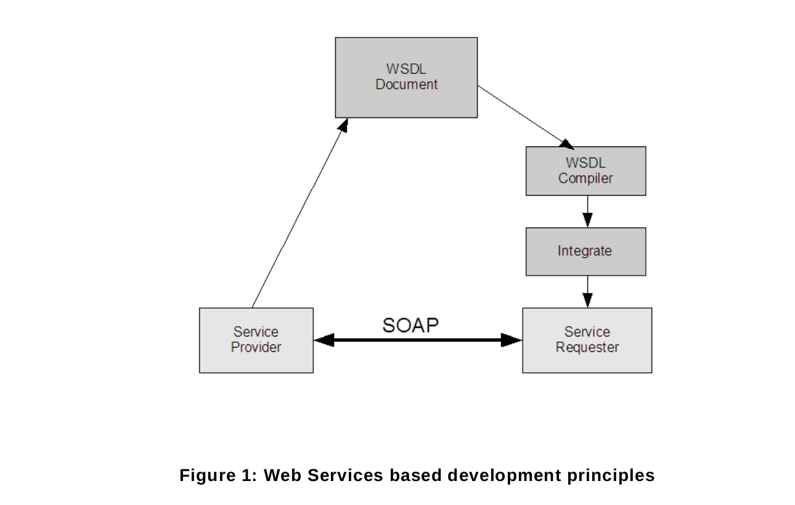

# 4 概述

本規範起源於一個網路視訊實例，該實例包含了本地和廣域網場景，而且要擴展到通用的IP設備使用場景。
本規範通過定義他們服務端的借口，定義了一組配置和操作網絡設備的功能接口。

本標準覆蓋了設備發現，設備配置以及一個事件框架。

所有的服務共享一個公用的XML schema，所有的數據類型由[ONVIF Schema]提供定義。

# 4.1 Web Services

Web Services是一個標準的方法名稱,該方法在IP網絡上使用開放的,平臺無關的Web Services標準來整合應用程序.
包括XML,SOAP 1.2[Part 1]和WSDL1.1.XMl用於描述數據,SOAP用於消息傳送,WSDL用於描述服務.

這個框架建立在Web Services標準上.所有定義在標準中的服務配置表現為Web Services操作和定義在HTTP上的WSDL作為傳送基礎.

圖一給了給予Web Services開發的基本原則的概述.服務提供者(設備)實現ONVIF服務.服務使用給予XML的WSDL來描述.然後,
WSDL 作為請求者(客戶端)實現和集成的基礎.客戶端集成可以簡單的使用WSDL編譯器工具去生成平臺相關的代碼作為客戶端開發者去集成
Web 服務到自己的程序中.

Web Services提供者和請求者使用SOAP消息交換協議通訊.SOAP是一個輕量級的,基於XML的消息協議,用於在網絡傳送之前編碼Web服務請求中的信息和相應消息.
SOAP消息獨立於任何操作系統和協議,可以使用多種互聯網協議傳送.ONVIF標準定義符合使用SOAP消息描述Web服務的傳送協議.

Web Services概述章節介紹通用ONVIF服務的結構,規範中的命令定義,錯誤處理原則和安全機制.

為保證相互協同性，所有的ONVIF服務都遵循網絡服務互通組織（WS—I）的基本說明2.0建議,並使用document/literal模式.

# 4.2 IP配置

IP配置章節描述了IP配置的需求和建議.IP配置包含:
- IP 網絡通訊能力
- 靜態IP配置
- 動態IP配置

# 4.3 設備發現

配置接口定義在標準的以WS-Discovery標準為基礎的Web服務接口.使用這個標準讓重用一個現有的合適的Web服務發現框架成為可能，
而不是使用一個新的服務或者服務的定義.

這個標準介紹一個特殊的發現行為適用於例如視頻監控.例如,一個完整的發現交互包含一個定義良好的服務定義和一個搜索條件.
規範包含設備類型和為了達到他所定義的範圍.

一個成功的發現提供設備服務地址,一旦一個客戶端有了設備的地址,它就可以通過設備提供的服務獲取詳細的設備信息.具體看下面的
[4.5](04.05.md)章節.

除了標準web服務發現協議,該手冊還提供遠程設備發現代理用於發現註冊設備,即使客戶端和設備在不同域的網絡中也可以通過遠程發現代理來發現設備.

# 4.4 配置文件

設備可以分組，所以也會有多個配置文件。
每個配置文件和服務均包含在各自的說明書中。

# 4.5 設備管理

設備管理功能通過設備服務提供,設備服務是設備其他所有服務的入口點.設備服務的WSDL是有設備管理WSDL文件提供的.
設備管理接口由如下幾個主題組成.

* 功能
* 網絡
* 系統
* 安全

# 4.5.1 功能

功能命令允許一個客戶端去請求一個設備提供的服務，並且可以去決定設備提供哪種一般的或供應商特定的服務，
功能是根據服務所形成的，這個文檔對設備和事件服務的功能交換下了定義。關於其他的服務請參閱各自的服務規範說明。

* 設備  
    - 網絡
    - 系統
    - 安全
* 事件

不同類別的功能指明了這些命令和參數設置，它們可用於特定服務或服務類別

# 4.5.2 網絡

下面的網絡命令允許標準化的管理功能

* 獲取和設置 hostname(主機名)
* 獲取和設置DNS配置
* 獲取和設置NTP配置
* 獲取和設置DDNS(動態域名解析)
* 獲取和設置網絡接口
* 啟用/禁用和列出所有網絡協議
* 獲取和設置默認網關
* 獲取和設置0配置
* 獲取,設置,添加和刪除IP地址過濾器
* 無限網絡接口配置

# 4.5.3 系統

系統命令用於管理下面的設備參數

* 獲取設備信息
* 系統備份
* 獲取和設置系統日期和時間
* 恢複出廠
* 升級固件
* 獲取系統日誌
* 獲取設備診斷數據(支持信息)
* 重啟
* 獲取和設置設備發現參數

# 4.5.4 檢索系統信息

系統信息,諸如系統日誌,特定於供應商的支持信息和配置備份鏡像,可以通過MTOM或HTTP來恢複.

MTOM方法是由GetSystemLog, GetSystemSupportInformation和GetSystemBackup命令提供,HTTP方法是由
GetSystemUris命令提供; 這些從文件檢索到的URIs可以使用HTTP GET方法下載.

# 4.5.5 固件升級

一個設備可提供兩種升級固件的機制，第一種在MTOM模式下使用UpgradeSystemFirmware命令發送新的固件鏡像。  
第二種分為兩個階段，首先客戶端發送StartFirmwareUpgrade命令讓設備準備開始升級，然後使用HTTP POST發送固件鏡像。  

第二種機制被設計用在資源有限的設備上，通常這樣的設備在正常工作的情況下無法接收和處理新的固件鏡像。

# 4.5.6 系統還原

系統還原允許設備從一個備份的鏡像還原他的配置.也提供兩種方式來還原.
第一用RestoreSystem命令使用MTOM方式發送備份的鏡像,第二用StartSystemRestore命令使用HTTP POST操作發送備份鏡像.

# 4.5.7 安全

下面的安全操作用來管理設備的安全配置

* 獲取和設置安全策略
* 處理用戶證書和設置
* 開/關 HTTPS客戶端認證
* 生成Key和下載證書功能
* 處理IEEE 802.1X證書
* 處理IEEE 802.1X CA 證書
* IEEE 8.2.1X 配置

# 4.6 事件處理

事件處理是給予OASIS WS-BaseNotification 和 WS-Topics規範.這些技術可以在不重新定義事件處理原則,基本格式和通訊模式的基礎上
重用一個豐富的通知框架.

防火墻掃描, 根據WS-BaseNotification是通過PullPoint通知模式,然而這個模式不支持實時通知.因此,這個規範定義一個替代PullPoint
通訊模式和服務接口.PullPoint模式允許一個客戶端駐留在防火墻之後利用WS-BaseNotification框架接收實時通知.

一個完整的標準事件需要標準化的通知.然而通知主題很大程度上取決於應用程序的需要.這個規範定義一組基本的推薦設備支持的通知主題,
具體可以查看附錄A.此外,對於某些服務這個規範擴展了基本和強制通知主題.

事件服務的WSDL包含事件WSDL文件提供的擴展.

# 4.7 安全

這一章描述網絡安全需求,這個規範定義安全機制在兩個不同的通訊層面上.

* 傳送層面的安全
* 消息層面的安全

這個規範還定義如下的基於端口的網絡安全.

* IEEE 802.1X

一般的安全需求，定義和傳送安全需求在第10章詳細說明.消息層面的安全需求在5.12說明.IEEE802.1X需求在8.4.7章節說明
安全管理處理在下面的設備管理服務4.5.7中列出.

[繼續閱讀](05.00.md)
