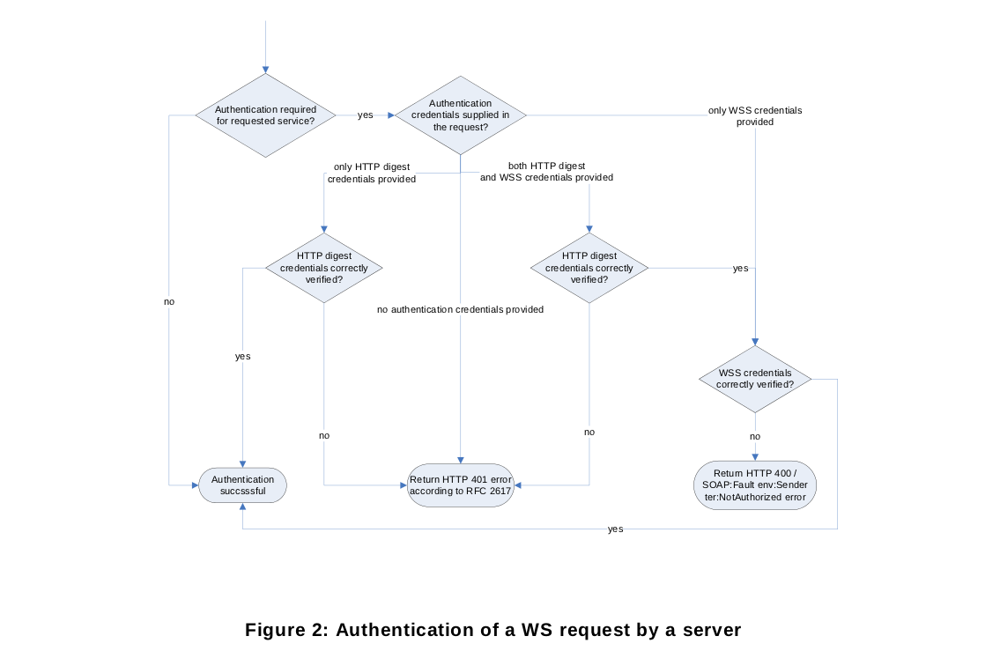

# 5.0 Web服務框架

所有的管理和配置命令是基於Web服務。

對於這個標準其目的：
 * 該設備是一個服務提供商。
 * 客戶端是一個服務請求者。
 
一個典型的ONVIF網路系統確實有多個客戶端為眾多設備處理設備配置和設備管理業務。另外一個提供服務的設備也可能扮演一個客戶端。

Web服務還需要一個常見的方式來發現服務提供者。通過使用通用的發現、描述和集成註冊中心(UDDI)規格(UDDI API ver2]、[UDDI數據結構ver2]。

UDDI規範使用服務代理實現服務發現。這個規範的目標設備的UDDI模型不是面向設備。因此，UDDI和服務代理是本規範的範圍之外。

根據這個規範,設備(服務提供商)使用WS-Discovery[WS-Discovery]的基礎技術。詳見第5.7節中描述的服務發現原則。

Web服務允許開發者自由定義服務和信息交流,這可能會導致協同工作問題。Web服務協同工作(ws - i)組織發展標準配置文件和指導方針來創建可協同合作的Web服務。
客戶的設備應當遵循在WS-I Basic Profile 2.0[ws ibp 2.0]的指導原則。ONVIF標準規範的服務描述則應當遵循WS-I Basic Profile 2.0的建議。


# 5.1 服務概述

一個ONVIF兼容的設備應當支持大量的Web服務定義和相關規範。

設備管理服務是所有設備的其他服務的入口, 因此為目標服務的ONVIF標準定義了WS-Discovery，詳情參閱第7章。

設備管理服務固定的入口點是：
http://onvif_host/onvif/device_service


# 5.1.1 服務要求

一個ONVIF兼容的設備應提供設備管理和事件服務。不同的設備類型的服務需求都定義在設備類型規範。

假設一個ONVIF兼容的設備支持某個特定的服務, 設備應回應所有定義在相應服務WSDL的命令。如果特定的命令不需要, 服務和設備不支持該命令, 設備應該回傳一個請求與錯誤代碼:
	env:Receiver,
	ter:ActionNotSupported,

詳見 5.11.2 定義的錯誤代碼。


# 5.2 WSDL概述

_WSDL描述Web服務的公共介面。這是一個基於XML的關於如何與Web服務通訊和使用的服務描述；也就是描述與目錄中列出的Web服務進行交互時需要綁定的協議和信息格式。
通常採用抽象語言描述該服務支持的操作和信息，使用的時候再將實際的網路協議和信息格式綁定給該服務。_

這個規範遵循WSDL 1.1規範和樣式。

WSDL document 包括以下內容:
 * 類型 - 使用XML架構定義的數據類型的定義。
 * 訊息 - 定義內容的輸入和輸出訊息。
 * 操作 - 定義的輸入和輸出訊息是如何關聯到一個邏輯操作。
 * 埠類型 - 操作的集合。
 * 綁定 - 規範的協議, 用於特定埠類型的訊息交換。
 * 埠 - 指定的地址綁定。
 * 服務 - 用於一組相關的埠。


# 5.3 命名空間

表1中列出在本標準中使用前綴和命名空間。這些可以使用任何不屬於標準的前綴。

## 表1：在本規範中定義的命名空間

前綴|命名空間URI|描述
----|----|----
tt|http://www.onvif.org/ver10/schema|在本規範的XML模式描述。
tds|http://www.onvif.org/ver10/device/wsdl|命名空間為WSDL設備服務。
trt|http://www.onvif.org/ver10/media/wsdl|命名空間為WSDL的媒體服務。
tev|http://www.onvif.org/ver10/events/wsdl|命名空間為WSDL事件服務。
ter|http://www.onvif.org/ver10/error|ONVIF定義的命名空間
dn|http://www.onvif.org/ver10/network/wsdl|命名空間用於遠程設備發現服務在這個規範。
tns|http://www.onvif.org/ver10/topics|命名空間為ONVIF主題的命名空間

在表2中列出的名稱空間引用此標準。

## 表2:引用名稱空間(前綴)
前綴|命名空間URI|描述
----|----|----
wsdl|http://schemas.xmlsoap.org/wsdl/|WSDL命名空間的WSDL框架。
wsoap12|http://schemas.xmlsoap.org/wsdl/soap12/|WSDL命名空間綁定WSDL SOAP 1.2。
http|http://schemas.xmlsoap.org/wsdl/http/|WSDL命名空間的WSDL HTTP GET和POST綁定。
soapenc|http://www.w3.org/2003/05/soap-encoding|編寫命名空間定義的SOAP 1.2[SOAP 1.2,第2部分]
soapenv|http://www.w3.org/2003/05/soap-envelope|封裝命名空間定義的SOAP 1.2[SOAP 1.2,第1部分]
xs|http://www.w3.org/2001/XMLSchema|實例命名空間定義的XS[xml - schema,第1部分]和[xml - schema,第2部分]
xsi|http://www.w3.org/2001/XMLSchema-instance|schema XML namespace論壇。
d|http://schemas.xmlsoap.org/ws/2005/04/discovery|設備發現定義的命名空間[WS-Discovery]。
wsadis|http://schemas.xmlsoap.org/ws/2004/08/addressing|設備尋址簡稱WS-Discovery的命名空間[WS-Discovery]。
wsa|http://www.w3.org/2005/08/addressing|設備尋址定義的命名空間所[WS-Addressing]。
wstop|http://docs.oasis-open.org/wsn/t-1|[WS-Topics]規範的架構命名空間。
wsnt|http://docs.oasis-open.org/wsn/b-2|架構命名空間[WS-BaseNotification]規範。
xop|http://www.w3.org/2004/08/xop/include|命名空間所定義的xml二進制優化打包[XOP]

表3是例外。

## 表3：參考的命名空間（不帶前綴）
命名空間URI|描述
----|----


# 5.4 類型

使用XML schema描述數據類型定義。

 * http://www.onvif.org/onvif/ver10/schema/onvif.xsd


# 5.5 訊息

根據WSDL1.1的操作說明在XML中使用輸入和輸出訊息。
訊息本體包含訊息內容。

本規範中的訊息主要包含兩個要素：
 * 訊息名稱
 * 訊息本體

訊息名稱指定元素的名稱,該名稱是用於操作定義的WSDL文檔。訊息名稱定義訊息的名稱。

WSDL訊息本體元素用於定義實際的訊息的格式。
可以有多個欄位在WSDL訊息中, 這個規範遵循WS-Ibasic概要(ws - i BP 2.0), 不允許跨訊息元素在一個訊息中。

下面的WSDL符號用於ONVIF規格:
<message name="’Operation_Name’Request”>
<part name="parameters" element="’prefix’:’Operation_Name’"/>
</message>

相應的，
<message name="'Operation_Name'Response”>
<part name="parameters" element="'prefix':'Operation_Name'Response"/>
</message>

'前綴'是在該訊息被定義的命名空間前綴。

本規範用於訊息特定類型封裝多個部件，以允許多個參數（或數據）的訊息。

# 5.6 操作

操作是定義WSDL埠類型聲明。操作可以是這兩種類型其中之一：

 * 單向 - 服務提供商接收到一條訊息。
 * 請求-回報 - 服務提供者接收一條訊息並發送一個相應的訊息。

根據不同的操作,可以使用不同的埠類型。

操作名稱定義了操作的名稱。

格式格式定義在表4。

## 表4：本說明書中使用的操作說明概要

訊息名稱|描述
----|----
‘Operation_Name’Request |請求訊息的描述。<br/>Typer1 Namer1 [ar1][br1]<br/>Typer2 Namer2 [ar2][br2]<br/>:<br/>Typern Namern [arn][brn]
‘Operation_Name’Response|回報訊息的描述。<br/>Types1 Names1 [as1][bs2]<br/>Types2 Names2 [as2][bs2]<br/>:<br/>Typesn Namesn [asn][bsn]
‘FaultMessage_Name’ |如果定義特定於操作的缺點, 描述了結構定義的錯誤訊息。
故障代碼|描述
Code<br/>Subcode<br/>Subcode |說明操作的具體故障。

大多數命令不定義任何特定的錯誤訊息。如果一條訊息有定義, 它遵循在表中的直接回報訊息。

故障代碼表中列出具體的故障代碼。任何命令可以返回一個通用的故障。

接入的Access_Class_Name定義類的操作。訪問類的操作特點的影響，請參閱第5.12.1.1。


# 5.6.1 單向操作類型

一個單向操作類型時使用服務提供者接收控制信息而不發送任何明確的信息確認。本規範使用單向操作。

這個操作類型是定義為一個單一的輸入訊息。

使用以下表格格式來描述單向操作:

訊息名稱|描述
----|----
‘Operation_Name’Request |請求訊息的描述。<br/>Typer1 Namer1 [a1][b1]<br/>Typer2 Namer2 [a2][b2]<br/>:<br/>Typern Namern [an][bn]

此表對應下面的WSDL符號在ONVIF規格:
<operation name=”’Operation_Name’”>
	<input message=”’prefix’:’Operation_Name’”/>
</operation>


# 5.6.2 請求-回報操作類型

一個請求-回報操作類型時, 使用的是一個服務提供者接收訊息和回報與一個相應的訊息。

這個操作類型是定義為一個輸入,一個輸出和多個故障訊息。

使用以下表格格式來描述請求-回報操作:

訊息名稱|描述
----|----
‘Operation_Name’Request |請求訊息的描述。<br/>Typer1 Namer1 [ar1][br1]<br/>Typer2 Namer2 [ar2][br2]<br/>:<br/>Typern Namern [arn][brn]
‘Operation_Name’Response|回報訊息的描述。<br/>Types1 Names1 [as1][bs2]<br/>Types2 Names2 [as2][bs2]<br/>:<br/>Typesn Namesn [asn][bsn]
‘FaultMessage_Name’ |如果定義特定於操作的缺點,該字段描述了結構定義的錯誤訊息。
故障代碼|描述
Code<br/>Subcode<br/>Subcode |說明操作的具體故障。
此表對應下面的WSDL書寫方式：
<operation name=”’Operation_Name’”>
	<input message=”’prefix’:’Operation_Name’”/>
	<output message=”’prefix’:’Operation_Name’Response”/>
	<fault name> = “Fault” message = “’prefix’:’FaultMessage_Name’”>
</operation>


# 5.7 埠類型

埠類型是一組抽象操作和抽象訊息的集合。不同埠類型支援不同操作的集合。

所有的操作名稱的規格即為ONVIF的類別。每個操作類包含一個或多個操作。每個類別只持有一種類型的作業, 被分到到單個埠類型。一個單向操作和請求回報操作存在相同的埠類型。


# 5.8 綁定

一個綁定定義了具體的協議和傳輸數據格式用來規範特定埠類型。一個埠可能有多個綁定。

符合ONVIF標準裝置綁定定義根據本規範，紀錄在[WS-I BP2.0]

SOAP綁定可以有不同的格式。符合ONVIF標準的設備應該使用document中記載的格式。


# 5.9 埠

單個端點指定由一個地址綁定。每個埠應當被給予一個唯一的名稱。一個埠定義包含一個名稱和一個綁定屬性。


# 5.10 服務

服務是一組相關的埠。


# 5.11 錯誤處理
 
錯誤可能發生在通信、協議或訊息處理。

規範分類錯誤處理分為以下幾類:

 * 協議錯誤
 * SOAP錯誤
 * 應用程序錯誤


# 5.11.1 協議錯誤

HTTP和RTSP協議定義了一套標準的狀態碼[例如，1XX，2XX，3XX，4XX，5XX]。
https://support.google.com/webmasters/answer/40132?hl=zh-Hant|HTTP狀態碼


# 5.11.2 SOAP錯誤

由於Web服務的操作錯誤或SOAP訊息處理過程中產生的SOAP錯誤。通過SOAP fault訊息來回報並處理。SOAP規範提供了共同框架來處理錯誤。

一個SOAP錯誤訊息是一個正常的SOAP訊息和錯誤訊息的搭配。其中包含：

 * 故障代碼
 * 子代碼
 * 原因
 * 節點和作用
 * 故障細節

子代碼和故障細節元素信息項是用於攜帶專屬應用程序的錯誤信息。

ONVIF規範使用一個單獨的命名空間為特定的故障:

	ter = “http://www.onvif.org/ver10/error”.

不同的Web服務的SOAP錯誤訊息被定義為不同的Web服務。

錯誤訊息範例(HTTP SOAP 1.2錯誤訊息)。

```
HTTP/1.1 500 Internal Server Error
CONTENT-LENGTH: bytes in body
CONTENT-TYPE: application/soap+xml; charset=”utf-8”
DATE: when response was generated
<?xml version=”1.0” ?>
	<soapenv:Envelope
	xmlns:soapenv="http://www.w3.org/2003/05/soap-
	envelope"
	xmlns:ter="http://www.onvif.org/ver10/error"
	xmlns:xs="http://www.w3.org/2000/10/XMLSchema">
	<soapenv:Body>
		<soapenv:Fault>
			<soapenv:Code>
				<soapenv:Value>fault code </soapenv:Value>
				<soapenv:Subcode>
					<soapenv:Value>ter:fault subcode</soapenv:Value>
						<soapenv:Subcode>
							<soapenv:Value>ter:fault subcode</soapenv:Value>
						</soapenv:Subcode>
				</soapenv:Subcode>
			</soapenv:Code>
			<soapenv:Reason>
				<soapenv:Text xml:lang="en">fault reason</soapenv:Text>
			</soapenv:Reason>
			<soapenv:Node>http://www.w3.org/2003/05/soap-envelope/node/ultimateReceiver</soapenv:Node>
			<soapenv:Role>http://www.w3.org/2003/05/soap-envelope/role/ultimateReceiver</soapenv:Role>
			<soapenv:Detail>
				<soapenv:Text>fault detail</soapenv:Text>
			</soapenv:Detail>
		</soapenv:Fault>
	</soapenv:Body>
	</soapenv:Envelope>
```


下表總結了一般的SOAP故障代碼（故障代碼中定義了SOAP版本1.2第1部分：訊息傳遞框架）。伺服器和客戶端可以定義額外的故障碼供應用程序使用。

我們區分通用故障和特定的錯誤。任何命令可以生成一個通用的故障。

## 通用故障

表5列出了通用的故障碼，如適用，子碼​​。所有伺服器和客戶端實現將處理下面列出所有的缺點。任何web服務命令可以返回一個或幾個通用的故障。


## 表5：通用故障

故障代碼|子代碼|故障原因|描述
----|----|----|----
env:VersionMismatch||SOAP版本不匹配|設備發現無效元素信息項而不是預期的封裝元素信息項。
env:MustUnderstand||SOAP頭代碼塊不理解|一個或多個必需的SOAP頭代碼塊都不理解。
env:DataEncodingUnknown||不支持SOAP的數據編碼|SOAP頭塊或SOAP體子元素信息項是作用域與數據編碼不支持的設備。
env:Sender|ter:WellFormed|格式良好的錯誤|發生入侵格式良好的XML
env:Sender|ter:TagMismatch|標簽不匹配|有一個標簽名稱或命名空間不匹配。
env:Sender|ter:Tag|沒有標簽|XML元素標記不見了。
env:Sender|ter:Namespace|命名空間錯誤|發生SOAP命名空間錯誤。
env:Sender|ter:MissingAttr|所需的屬性不存在|缺失一個必要的屬性。
env:Sender|ter:ProhibAttr|禁止屬性|存在一個被禁止的屬性。
env:Sender|ter:InvalidArgs|無效的參數|一個錯誤由於下列: <br /> * 缺少的參數 <br /> * 參數太多 <br /> * 參數是錯誤的數據類型。
env:Sender|ter:InvalidArgVal|參數值無效|參數值是無效的。
env:Sender|ter:UnknownAction|未知的操作|一個未知的指定操作。
env:Sender|ter:OperationProhibited|操作不允許|請求的操作不允許的設備。
env:Sender|ter:NotAuthorized|發送方未授權|請求的操作需要授權和發送方未被授權。
env:Receiver|ter:ActionNotSupported|可選操作未執行|請求的操作是可選的，而不是由設備實現。
env:Receiver|ter:Action|操作失敗|請求的SOAP操作失敗。
env:Receiver|ter:OutofMemory|內存不足|設備沒有足夠的內存來完成此操作。
env:Receiver|ter:CriticalError|臨界誤差|該設備已經遇到一個錯誤條件,它不能恢複本身,需要重置或動力循環。

## 特定故障

具體的故障只適用於一個特定的命令或命令集。

## HTTP錯誤

如果伺服器等待開始的訊息時沒有收到的SOAP訊息, 伺服器不應產生一個SOAP錯誤, 而是發送一個HTTP錯誤回報:。

## 表6:HTTP錯誤

HTTP錯誤|HTTP錯誤代碼|HTTP原因
----|----|----
Malformed Request|400|錯誤請求
Requires Authorization|401|非法的請求；未被授權的請求
HTTP Method is neither POST or GET|405|不允許使用該方法
Unsupported message encapsulation method|415|不支持的媒體

伺服器應該避免表內錯誤, 因為這可能暴露安全漏洞, 可能被濫用。


# 5.12 安全

本標準中定義的服務應當保護或者使用摘要式身份驗證依據(RFC 2617)或ws - security框架。
WS-Security規範定義了一套標準的SOAP擴展，可以用來提供Web服務訊息的完整性和保密性。該框架允許使用標記幾種不同的安全模型。定義的標記如下：
 * 用戶名稱TOKEN[WS-UsernameToken]
 * X.509安全TOKEN[WS-X.509Token]
 * SAMLTOKEN[WS-SAMLToken]
 * KerberosTOKEN[WS-KerberosToken]
 * 權利表達式語言(REL)TOKEN[WS-RELToken]

如果伺服器同時支持如[RFC2617]中規定的摘要式身份驗證和用戶名TOKEN指定WS-Security中的下列行為應當適應：一個Web服務請求進行身份驗證通過HTTP級別的摘要式身份驗證[RFC2617]或在網絡上通過服務水平的WS-Security（WSS）框架。如果客戶端不提供身份驗證憑據，隨著Web服務請求，伺服器應假設該客戶打算使用摘要身份驗證[RFC2617]，如果需要的話。因此,如果客戶不提供身份驗證憑證當請求一個服務需要身份驗證,它將接收一個HTTP 401錯誤根據(RFC 2617)。請註意，這種行為對伺服器端的不同之處的情況下，僅支持用戶名TOKEN的個人主頁上，這需要對於這種情況一個HTTP 400錯誤在HTTP水平和SOAP:Fault env:發送方ter:NotAuthorized誤差對WS級別。

客戶端不應該同時提供身份驗證憑據的HTTP級別和WS級別。如果伺服器接收到Web服務請求，HTTP級別的和WS級別的包含身份驗證憑據的，應當先驗證HTTP層上提供的憑據。如果驗證成功，伺服器將最終驗證的WS層上提供身份驗證憑據。

圖2總結了身份驗證的一個web服務請求的伺服器。



兩個摘要式身份驗證和用戶名TOKEN只給出了最基本的安全。在一個系統,安全是很重要的,建議總是配置裝置基於tls訪問(見10.1)。摘要式身份驗證或用戶名TOKEN訊息級安全性結合TLS,客戶機和伺服器身份驗證,保護傳輸級安全性給一個可接受的安全水平在許多系統。

一個ONVIF兼容的設備應該認證一個請求的RTSP RTSP水平。如果HTTP用於隧道的RTSP請求設備不得在HTTP身份驗證級別。

符合ONVIF標準的設備應進行身份驗證時，RTSP和HTTP方法使用從同一組憑據，用於對WS​​部分用戶/用戶/憑據。對於用戶自定義的用戶名TOKEN，摘要式身份驗證[RFC 2617]應當用於RTSP和HTTP。


# 5.12.1 基於用戶的訪問控制

節中描述的授權框架。5.12允許的服務請求進行身份驗證。一旦服務請求進行身份驗證，該設備應決定根據請求者是否被授權接收服務訪問策略。

一個設備可以支持一個自定義的訪問策略的定義由設備用戶通過get和set訪問策略，在8.4節中定義的操作。

# 默認訪問政策

默認情況下,該設備應執行以下默認訪問政策,給一個可接受的安全級別在許多系統。

每個用戶是完全相關的下列用戶級別:
	1.管理員
	2.運營商
	3.用戶
	4.匿名

未經授權的用戶放置到匿名類和設備不得允許用戶被添加到匿名用戶級別類別。

服務分為訪問類為基礎的影響(見5.6節)。下面的訪問類定義:
 * PRE_AUTH
   服務不需要用戶身份驗證。
   例如:GetEndpointReference
 * READ_SYSTEM
   服務從設備讀取系統配置信息。
   例如:GetNetworkInterfaces
 * READ_SYSTEM_SENSITIVE
   服務從設備讀取敏感(但不是真正的機密)系統配置信息。
 * READ_SYSTEM_SECRET
   服務讀取系統配置信息的保密設備。
   例如:GetSystemLog
 * WRITE_SYSTEM
   服務原因更改系統配置的設備。
   例如:SetNetworkDefaultGateway
 * UNRECOVERABLE
   服務導致不可恢複的改變系統配置的設備。
   例如:SetSystemFactoryDefault
 * READ_MEDIA
   服務讀取相關數據記錄媒體。
   例如:GetRecordings
 * ACTUATE
   服務會影響系統的運行時行為。
   例如:CreateRecordingJob

默認的訪問策略基於關聯以下列方式的服務和授予訪問權限的訪問類。 C級應給予用戶訪問到相關的服務來訪問R類，當且僅當“X”是存在於單元格在的列c和r行表7。

## 表7默認訪問策略定義

 |管理員|運營商|用戶|匿名
----|----|----|----|----
PRE_AUTH|X|X|X|X
READ_SYSTEM|X|X|X|
READ_SYSTEM_SENSITIVE|X|X| |
READ_SYSTEM_SECRET|X| | |
WRITE_SYSTEM|X| | |
UNRECOVERABLE|X| | |
READ_MEDIA|X|X|X|
ACTUATE|X|X| |


# 5.12.2 用戶名標記配置文件

客戶端應使用場合和時間戳兩個來定義[ws usernametoken]。伺服器應拒絕任何用戶名TOKEN不使用這兩種場合和時間戳。

這個規範定義了一組命令來管理用戶憑證,見8.4。這些命令允許關聯用戶不同用戶級別定義在5.12.1。

## 密碼派生

在一些設備上使用相同的認證引入了一定的安全隱患。要求用戶提供一個獨特的憑據為每個設備是不可行,而不是客戶端使用用戶名TOKEN概要文件應該和一個客戶端使用摘要式身份驗證可以實現以下密碼派生算法。

表示任意一個用戶通過UA。表示由p UA密碼使用的值由用戶來訪問設備UA的系統。此外表示NEP終端設備服務點參考價值系統中的特定設備。最後,表示由pe ua密碼等效客戶用來訪問一個特定的設備。客戶端應該計算pe ua如下:

	PE_UA = base64(HMAC_SHA-1(UA+P_UA,NEP+”ONVIF password”)),

其中“+”表示連接和“ONVIF密碼”是一個ASCII字符串。它應包括確切的形式，它沒有給出一個長度字節或尾隨空字符，即以下的十六進制值：4F 4E 56 49 46 20 70 61 73 73 77 6F 72 64.

HMAC_SHA-1是在[RFC2104]中規定的算法，使用SHA-1[FIPS180-2]作為底層的算法。使用HMAC功能的關鍵價值是串聯的用戶名和密碼，UA + P_UA，直接映射到等值的二進制數。相似的，價值PE_UA的應被映射到其對應的ASCII碼，在傳輸前的移動設備。

base64描述(RFC 3548),註意操作的結果是實際的base64密碼等效,相當於應使用的。

## 例子

假設下面的用戶名和密碼將用於客戶端（ASCII）：“user”和“VRxuNzpqrX”，即，

```
	UA = 75 73 65 72
	P_UA = 56 52 78 75 4E 7A 70 71 72 58
```

接下來,假設該設備具有以下設備服務端點引用的值:

	Urn:uuid:f81d4fae-7dec-11d0-a765-00a0c91e6bf6.

然後，將要使用的密碼相當於然後的計算，計算公式為：

```
	PE_UA = base64(HMAC_SHA-1(UA+ P_UA,NEP+”ONVIF password”)) =
	base64(HMAC_SHA-1(75736572565278754E7A70717258,
	F81D4fAE7DEC11D0A76500A0C91E6BF64F4E5649462070617373776F7264)) =
	base64(16 E5 C5 A9 4D DE 8A 97 6D D7 2F 55 78 5F C2 D0 6B DA 53 4A)=
	FuXFqU3eipdt1y9VeF/C0GvaU0o=
```

由此產生的密碼等“FuXFqU3eipdt1y9VeF/C0GvaU0o=”是由客戶端應使用特定的設備上配置的用戶憑據，然後訪問該設備的密碼。


# 5.13 字符串表示形式

以下分段適用於所有ONVIF標準的服務。


# 5.13.1 Character Set

設備應支持utf - 8字符集和它可能支持其他字符集。如果一個客戶端發送一個請求使用utf - 8,設備應當總是回複使用utf - 8字符集。


# 5.13.2 允許字符串中的字符

一個設備不應當有任何限制字符字符串有關法律不明確表示在這個和其他ONVIF規格。

[繼續閱讀](06.00.md)
