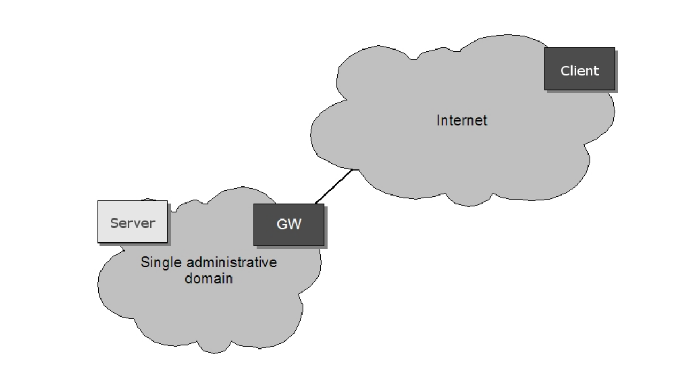
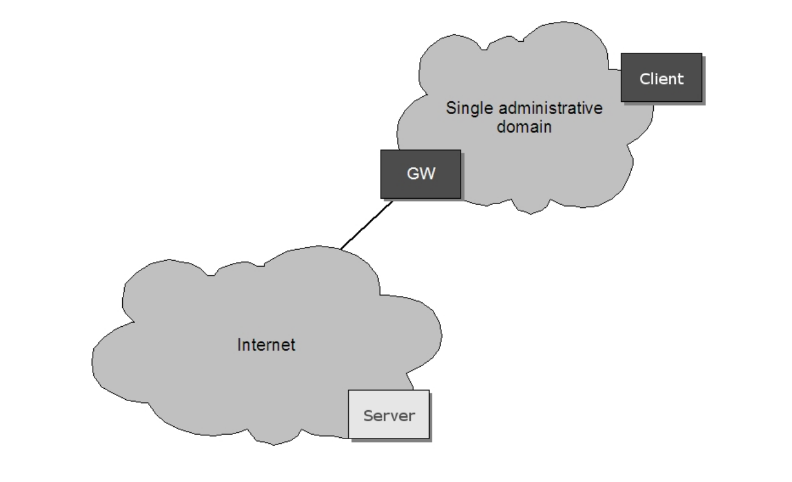
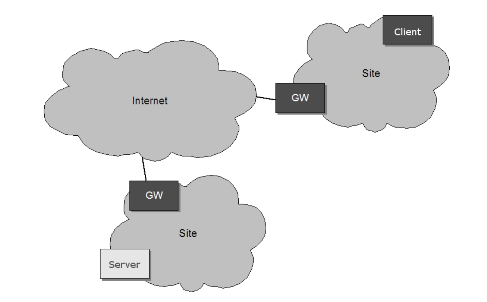
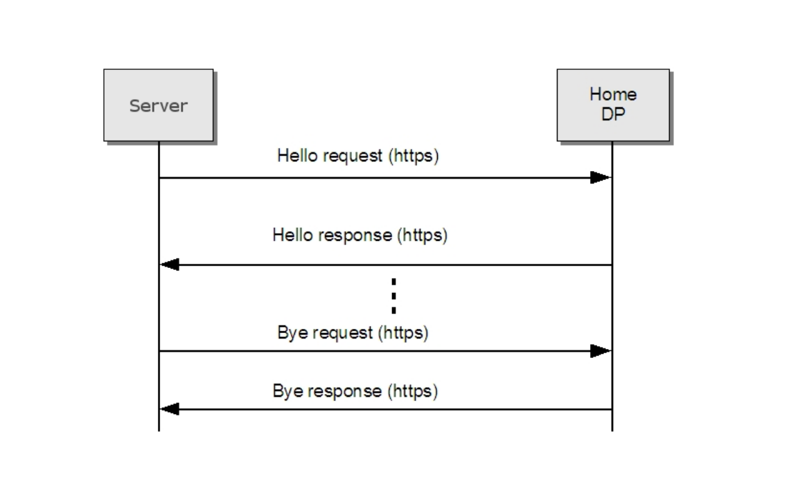
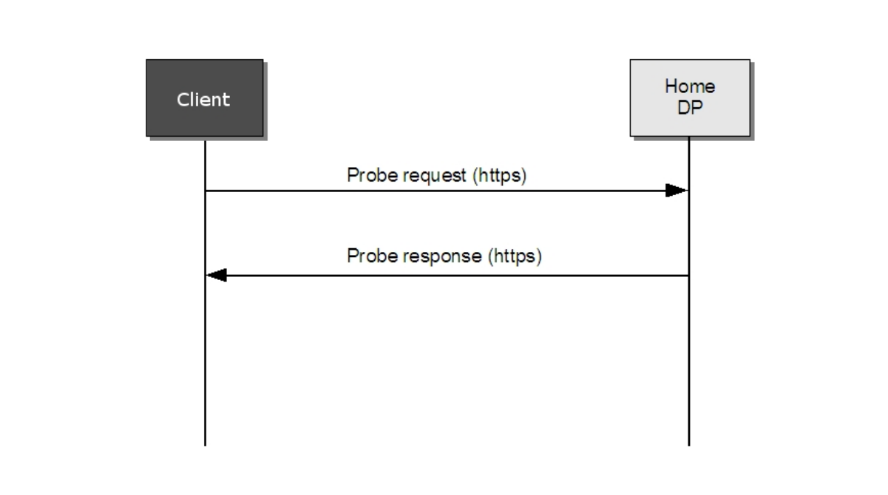

# 7 設備發現

# 7.1 概述

客戶端搜索可用設備是透過動態Web服務發現協議[WS-Discovery]。

[WS-Discovery]所指定的設備應符合本規範實施目標。

如果有必要，應遵照本客戶端的規範實作客戶端，在[WS-Discovery]指定。

在[WS-Discovery]所描述的發現代理的角色不受設備或客戶端的支援（另一種發現代理的角色在本規範有介紹，參見7.4節）。
在[WS-Discovery]第三節所描述的設備實現了客戶端的作用，忽視了與發現代理的互動方案。
相反，這個規範定義了一種新的發現代理的角色，允許遠程發現。遠程發現依賴於一個發現代理和一個系統供應商的存在，要在系統中提供遠程發現功能，應該實現在章節7.4中所描述的發現代理的角色。

通用唯一識別(UUID): 端點引用的URI格式。
統一資源名稱：通用唯一標識符（URN：UUID）格式被定義在[RFC4122]（參見7.3.1節）。

# 7.2 操作模式

設備可在兩種模式下運行：

* 可發現的
* 不可發現的

當設備工作在可發現模式時，透過群播發送Hello訊息，一旦連接上網路則會回傳狀態改變的訊息。同時它一直在監聽Probe和Resolve訊息並立即回應。
工作在不可見模式的設備不用監聽訊息或回應。

設備預設是可發現模式。可透過8.3.19中定義的操作來設置設備。

# 7.3 發現定義

# 7.3.1 端點引用

設備或端點作為客戶端的角色時應該使用URN:UUID [RFC4122]作為其端點引用的地址。

設備或端點作為客戶端的角色時，應使用穩定的全局唯一標識符作為其端點引用屬性的一部分，該標識符是固定的網路接口。
結合一個wsadis:Address 和 wsadis:ReferenceProperties的提供一個穩定和全球唯一的標識符。

# 7.3.2 Hello

1.類型

符合ONVIF標準的設備應包括設備管理服務的埠類型，即tds:Device，在<d:Types>中聲明。

下面的範例示範了這種類型如何被編碼在SOAP的Hello body中：

<d:Types>tds:Device</d:Types>.

Hello訊息可能包括額外的類型。

2.Scopes

符合ONVIF標準的設備應該包含範圍<d:Scopes>屬性，在Hello訊息中的設備範圍。

設備範圍通過[RFC 3986]的URI來設置。該規範定義了scope屬性如下：

The scheme attribute:onvif

The authority attribute:www.onvif.org

設備可能有其他範圍的URI。ONVIF標準定義的範圍不僅限於這些URI。

表8中定義了一組範圍參數。除了遵從這些標準化的參數，它應是可被設置為設備所有者所定義的任何範圍參數。設備參數可以列出，並通過8.3節定義的命令設置。

設備可能有其他範圍的URI。這些URI並不僅限於ONVIF定義的scope。

## 表8：範圍參數

名詞|值定義|解釋|
----|----|---
Profile| 任意字符串| 表示設備所支援的配置文件的值。定義的值在本文件的範圍之外，並在配置文件中規範定義。
Location| 任意字符串或路徑值| 定義了設備的物理位置。位置值可以是任意字符串來描述設備的物理位置。
Hardware| 任意字符串或路徑值| 字符串或路徑值描述設備的硬體訊息。設備應至少包括一個硬體設備到其範圍列表中。
Name| 任意字符串或路徑值| 設備的可搜索的名稱。設備至少應包括一個名字到其範圍列表中。

設備應該包括至少一個固定的入口（由設備供應商定義的）的剖面，分別為硬體和名稱類別包含在範圍列表中。一個設備可以在範圍列表中包含任何其他額外的範圍屬性。

設備可能包括在其範圍內的任意數量的範圍列表。這意味著，一個單位可能例如定義多個不同位置的範圍。一個連結對列表中的所有範圍匹配。

2.1 Example

下面的例子演示了範圍值的使用。這僅僅是一個例子，並沒有在所有的指示是什麽類型的範圍參數作為設備配置的一部分。在這個例子中，我們假設該設備配置了以下範圍：

onvif://www.onvif.org/Profile/Streaming
onvif://www.onvif.org/hardware/D1-566
onvif://www.onvif.org/location/country/china
onvif://www.onvif.org/location/city/bejing
onvif://www.onvif.org/location/building/headquarter
onvif://www.onvif.org/location/floor/R5
onvif://www.onvif.org/name/ARV-453

客戶端與範圍onvif://www.onvif.org將會得到一個匹配的連結。

同樣，具有以下範圍屬性的的設備將會得到一個匹配的連結：

onvif://www.onvif.org/location/country/china

具有以下屬性的連結將會不匹配：

onvif://www.onvif.org/hardware/D1

3.Address

在Hello訊息中，設備應包含帶有設備地址訊息的<d:XAddrs>節點。應提供一個URI為每個協議（http,https）和外部可用的IP地址。

設備的IP地址配置規則定義在5.12.2.1.1章節。

# 7.3.3 探頭和探頭匹配

設備的探頭匹配包括類型，範圍和地址等定義，參見7.3.2 Hello。

符合ONVIF標準的設備至少應支援
http://schemas.xmlsoap.org/ws/2005/04/discovery/rfc3986 範圍的匹配規則。此範圍匹配定義與[WS-Discovery]的定義略有不同，因為[RFC
2396]已被[RFC 3986]所取代。

在匹配探頭的匹配訊息中設備應包括帶有設備服務地址訊息的<d:XAddrs>節點。<d:XAddrs>節點在大多數情況下只包含一個地址到5.1節所定義的設備管理服務中。

# 7.3.4 解析和解析匹配

本規範要求終端地址訊息要被加入到Hello訊息和Probe Match訊息中。在大多數情況下，沒有必要解析和解析匹配交換。與[WS-Discovery]規範兼容，但是，設備應
實現解析匹配響應。

# 7.3.5 Bye

當一個設備準備離開網路時應該發送一個單向的Bye訊息，正如在WS-Discovery所描述的那樣。

# 7.3.6 SOAP錯誤訊息

如果組播包出現錯誤，設備和客戶端應該默默的丟棄，忽略該請求。

不建議發送錯誤響應，因為可能出現許多設備對同一個請求均發送錯誤響應而導致數據包風暴。為了完整起見，單播數據包的錯誤處理在下面描述。

[action] http://schemas.xmlsoap.org/ws/2005/04/discovery/fault

[Code] s12:Sender

[Subcode] d:MatchingRuleNotSupported

[Reason] E.g., the matching rule specified is not supported

[Detail] <d: SupportedMatchingRules>

List of xs:anyURI

</d: SupportedMatchingRules>

# 7.4 遠程發現擴展

本節介紹了可選的發現擴展需要更複雜的網路情況。支援遠程服務發現的設備應支援在本節中定義的發現擴展。

本節中定義的遠程發現擴展可以與普通的基於WS-Discovery計劃的組播如本規範所定義的那樣一起使用。例如，遠程發現擴展可以與普通的“本地”發現一起並行工作。

# 7.4.1 網路方案

如果客戶端和設備不駐留在同一個管理域，它是沒有可能為客戶端找到並連接到設備使用多播的連結。
例如，如果該設備或客戶端駐留在防火墻或NAT（網關GW）在一個網路中，它不能連接到多播的連結。然後，其他的方法需要，本說明書使用了四種不同的情況：

1. 設備駐留在一個管理域（私人）和客戶端駐留在公共網路，見圖3。
2. 設備駐留在公共網路和客戶端駐留在一個管理域（私人），見圖4。
3. 設備駐留在一個管理域（私人）和客戶端駐留在另一個管理域（私人），見圖5。
4. 駐留在公用網路中的設備和客戶端，請參閱圖6。

[WS-Discovery]規範引入了一種發現代理(DP)以解決一些方案。然而 [WS-Discovery]規範沒有支援本規範中所引入的所有網路場景。
本規範定義了一個DP，使得“即插即用”在我們已經在上面列舉過的更複雜的網路方案中可行。這個DP不符合 [WS-Discovery] 規範。

# 7.4.2 發現代理

廣域網中的設備跨越多個管理域的網路配置，網路管理員需要引進一個DP端點進入系統。 DP執行以下任務：
1. 監聽設備hello訊息和響應這些定義在7.4.3節。
2. 響應代表的註冊客戶端設備上的查詢的探測。

DP可能像設備一樣駐留在同一個管理域。客戶端和設備駐留在不同的域無法通過組播相連接時，為了支援這種網路情景，將DP放在一個公開的可用的網路以便設備和客戶端的端點可以訪問它。
為了讓設備的Hello訊息準確直達發送到它的home DP宣布它的存在， 應讓設備能找到它的“home DP”的網路地址。在本說明書中，home DP網路地址可以通過兩種方式獲得：
1. 直接地址配置。
2. DP發現使用DNS服務記錄（SRV）查詢。

一旦設備得到網路連接或當home DP的網路地址改變時，設備就會試著使用這些方法去連接到home DP。應能操作啟用或禁用設備遠程發現註冊功能。
支援遠程發現的設備應實現遠程Hello的啟用和禁用操作，定義詳見8.3.21節。

在7.4.3節中定義了，當一個設備未配置home DP地址或設備禁用了遠程Hello操作時將無法發送遠程Hello訊息。

1. 直接DP地址配置 
該規範引入了一種通過網路接口配置home DP地址的設備管理命令，請參閱8.3.22和8.3.23節。

2. DNS服務記錄查詢
如果設備要啟用遠程發現，但是缺乏遠程DP地址配置，應當試著進行DNS SRV查詢該home DP。應使用以下由[RFC2782]定義的記錄名稱和協議：

_onvifdiscover._tcp

為了避免設備的DNS SRV查詢，在啟用遠程發現前應通過直接地址配置一個DP地址。
為了讓設備通過DP查詢成功的發現其他設備，管理員應該輸入DP地址，端口和優先級到使用SRV的DNS配置中。需存在一個或多個註冊服務器。確切的數目取決於系統的負荷，並且在本說明書的範圍之外。

# 7.4.3 遠程Hello和探測行為

在[WS-Discovery]中定義的本地發現模式並不適用於遠程發現場景。如果該設備駐留在NAT/防火墻後面，類似圖3或圖5所示，如果設備不返回一個公共網路地址，從DP發出的單播探測將不會自動連接到該設備。此外，如果該設備駐留在防火墻後面，與該設備匹配的單播探測包可能無法回到DP。該規範定義了一個稍微不同的通信模式的遠程發現來解決這個問題。

當一個設備配置為遠程Hello時，除了當設備加入一個網路或當它的元數據發生變化時需發送一個組播的Hello訊息，還要發送遠程Hello訊息到它的home DP。此訊息被當作一個Web Service的請求操作從設備發往DP，如[ONVIF DP WSDL]所定義的那樣使用HTTP綁定。遠程Hello應該在Hello訊息中應包括範圍列表。

一旦home DP接收到來自任何設備的一個Hello訊息，它將通過一個Hello響應訊息來響應確認設備通過Hello訊息註冊。

同樣的，當設備準備離開網路前，它應該先發送一個Bye請求到遠程DP。DP通過Bye響應訊息來響應已通過Bye請求。

DP Hello，Hello 響應，Bye和Bye響應作為一個DP服務來提供，請參閱[ONVIF DP WSDL]的WSDL定義部分。

使用這些擴展，發現訊息可以到達所需的端點。

# 7.4.4 客戶端行為

在遠程發現的情況下，客戶端需要發送探測訊息到home DP。然後，客戶端需要進行配置，這樣它就可直接連接到home DP。

當客戶端配置為遠程發現時，直接發送探測訊息到它的home DP。使用HTTP綁定的(見[ONVIF DP WSDL]]探測訊息作為一個Web Services的請求操作從客戶端發送至DP。

一旦home DP接收到來自任何客戶端的探測訊息，它根據普通的WS-Discovery訊息交換模型，通過相應的探測匹配訊息來響應，參見圖8的序列圖。

# 7.4.5 安全

1. 本地發現

安全性和可見性可以看作是相互矛盾的目標。當發現協議背後的主要思想是宣布服務的存在，是很難排除其他端點訪問服務的通告。即使在同一個局域網，WS-Discovery不提供任何額外的訪問服務（如果使用本規範中指定的其他安全機制）；它只是宣布它們的存在。此外，本地發現只在組播可達的範圍內工作。因此，WS-Discovery的主要安全影響是設備上的拒絕服務攻擊的風險，或隱私方面的問題如果在網路中隱藏設備的存在很重要的話。後兩個問題的風險很大程度上取決於設備的部署環境。為了減少這些威脅，本規範已經制定了兩種不同的發現模式，參見7.2節。這總是為客戶端在設備上關閉設備發現功能提供了可能性。在不可見模式下，設備將永遠不會通過發送Hello訊息或響應任何探測訊息或解析請求來宣布它的存在。

2. 遠程發現

DP駐留在遠程網路的情況下，在互聯網上是很脆弱的。那麽，應采取額外的安全措施，以保護DP防止攻擊。遠程Hello和探測和探測匹配訊息，應通過HTTPS發送，定義參見7.4.3.這種傳輸不會阻止拒絕服務攻擊，但如果使用客戶端身份驗證，它可以保護它免受非法設備註冊。如果拒絕服務保護是一個重大的問題，需要采取其他的措施，這在當前規範討論的範圍之外。

在註冊一個設備到DP的設備數據庫之前，DP應該驗證設備以確保它是一個“合法”的設備，以宣布它的存在，例如通過使用客戶端證書。客戶端證書配置在當前規範討論的範圍之外。

應通過HTTPS發送客戶端的遠程探測和探測匹配訊息到DP。DP應該在響應探測請求之前先驗證客戶端有效性。這可以通過使用TLS客戶端證書，或其他任何合適的客戶端身份驗證機制。

[上一章](07.04.04.md)|[繼續閱讀](08.00.md)
