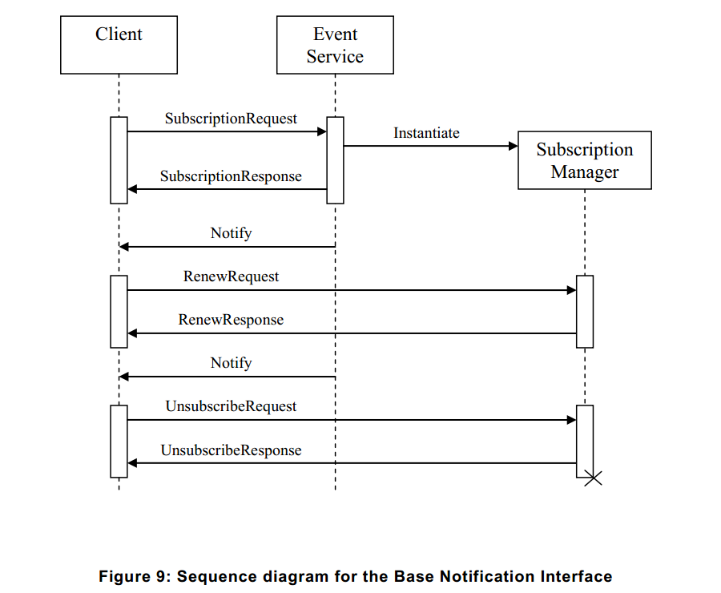
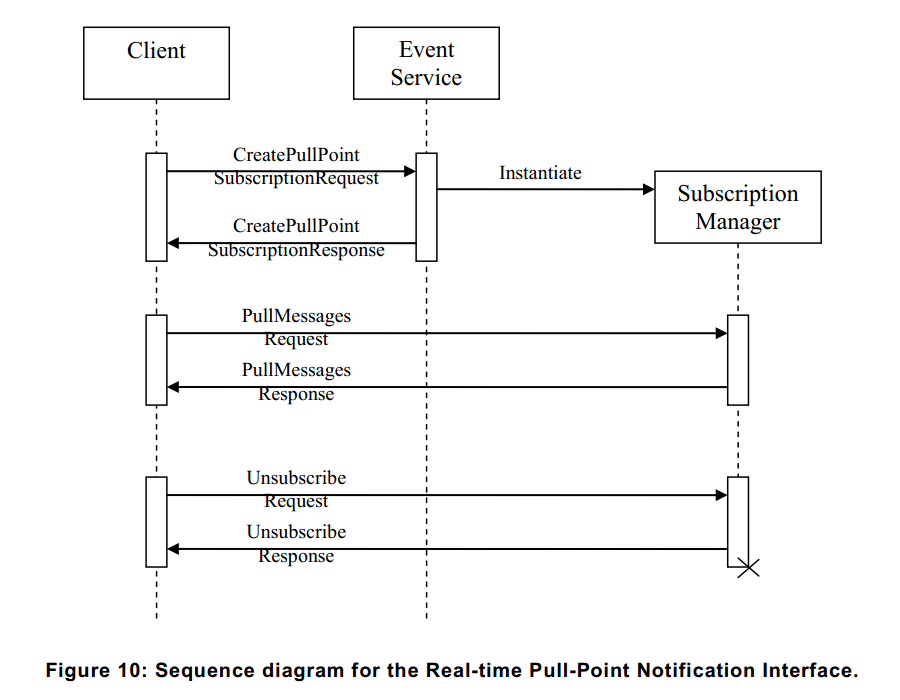

# 9 事件處理

客戶端可以訂閱設備的事件動作或檢測到的事件信息。
事件通過事件服務進行處理，符合ONVIF標準的設備應提供基於[ONVIF Event WSDL]規範的事件服務。
設備和客戶端都支持[WS-Addressing]規範的事件服務。

本標準中的事件處理的基於[WS-BaseNotification]和[WS-Topics]規範。
如果功能MaxNotificationProducers不為零或不存在，該標準要求實施[9.1](09.01.md)節所述的基本通知接口。
此外，設備應實施實時的拉點（Pull-Point）通知接口和流通知接口，詳細信息將在[9.2](09.02.md)節和[9.3](09.03.md)節中介紹。

該標準引入通知消息的擴展，客戶端可以通過事件來跟蹤對象的屬性（如視頻分析對象的屬性）。
屬性將在[9.4](09.04.md)節進行描述。

第[9.5](09.05.md)節描述事件的有效負荷和討論訂閱範圍過慮。
第[9.6](09.06.md)節介紹如何同步點可以要求客戶使用三個通知接口之一。
第[9.7](09.07.md)節描述了主題一體化。
第[9.9](09.09.md)節討論故障處理。

最後一節中詳細演示了實時拉點（Pull-Point）的通知接口，包括消息過慮和主題設置的用法。
基本通知接口的例子中可以找到相應的[WS-BaseNotification]規範。

# 9.1 基本通知接口

第[9.1.1](09.01.01.md)節簡要介紹了基本通知接口[WS-BaseNotification]規範。
第[9.1.2](09.01.02.md)節總結了[WS-BaseNotification]規範的強制性和可選的接口。

# 9.1.1 引言

下列邏輯實體參與通知模式：
	客戶端（Client）：實現NotificationConsumer接口。
	事件服務（Event Service）：實現NotificationProducer接口。
	訂閱管理器（Subscription Manager）：實現BaseSubscriptionManager接口。
事件服務和訂閱管理器在設備上應該被實例化。

圖9中所示的是典型的實體之間交換消息的序列圖
首先，客戶端建立一個連接到事件服務。然後，客戶端可以通過發送SubscriptionRequest訂閱一些通知。
如果事件服務接受訂閱，它會動態實例化一個SubscriptionManager來表示訂閱。
The Event Service shall return the WS-Endpoint-Address of the SubscriptionManager in the SubscriptionResponse.
【事件服務應該返回在SubscriptionResponse中SubscriptionManager的WS端點地址（WS-Endpoint-Address）。】

為了傳送與訂閱相匹配的通知，另建立一個從事件服務到客戶端的連接。
通過此連接，事件服務發送一個單向通知消息到客戶端的NotificationConsumer接口。
通過事件服務到客戶端可以在任何時間發送相應的通知，而訂閱是活躍的。
To control the Subscription, the client directly addresses the SubscriptionManager returned in the SubscriptionResponse.
【若要控制訂閱事項，則客戶端在SubscriptionResponse中直接返回SubscriptionManager的地址。】
在SubscriptionRequest中，客戶端可以指定一個終止時間。當達到終止時間時，自動銷毀SubscriptionManager。
客戶端可以啟動RenewRequests來推遲終止時間。客戶端也可以發送一個退訂請求（UnsubscribeRequest）來明確終止SubscriptionManager。
退訂成功後，SubscriptionManager不再存在。
在[WS-BaseNotification]規範和實現設備中事件服務與SubscriptionManager之間的交互沒有進一步指定。



# 9.1.2 需求

本節詳細介紹設備應提供[WS-BaseNotification]規範的那些接口。

一個符合ONVIF標準的設備應支持[WS-BaseNotification]規範的NotificationProducer接口。
作為一個結果，NotificationProducer資源屬性都是可選的（請參閱第[9.5](09.05.md)節）。
第[9.7.3](09.07.03.md)節中的專業用語描述了設備應支持TopicExpression過慮。
通過GetEventProperties方法支持MessageContent過濾。
如果設備不接受訂閱初始終止時間，應當提供有效的初始終止時間內的故障信息。
設備應能夠使用[WS-BaseNotification]規範的通知包裝器（Notify wrapper）來提供通知。
設備的訂閱政策（SubscriptionPolicy）wsnt:UseRaw 是可選的。[WS-BaseNotification]規範雖然有當前時間（CurrentTime）和終止時間（TerminationTime）作為SubscribeResponse和RenewResponse中的可選元素，符合ONVIF標準的設備應列出SubscribeResponses和RenewResponse兩個。
設備可以響應任何GetCurrentMessage請求與故障信息表明在所需的主題上目前沒有可用的消息。

實施[WS-BaseNotification]規範中的拉點（Pull-Point）接口在設備上是可選的。

符合ONVIF規範的設備應實現[WS-BaseNotification]規範包含的續訂和退訂操作的基本訂閱管理接口。
可暫停訂閱管理接口是可選的，實施WS資源訂閱(WS-Resources)是可選的。

符合ONVIF標準的設備應支持UTC與“Z”指標中給出的時間值的請求參數和響應包括“Z”指標為UTC的所有時間值。

# 9.2 實時拉點(Pull-Point)通知接口

本節介紹實時拉點通知接口。這個接口提供了友好的防火墻通知接口使實時輪詢並初始所有客戶端的通信。

該接口用於以下列方式：

1、客戶端要求為拉點訂閱（PullPointSubscription）設備創建拉點訂閱請求（CreatePullPointSubscriptionRequest）消息。對比訂閱的基本通知接口，ConsumerReference應省略（請參閱第[9.1](09.01)節）。

2、當訂閱被接受或一個故障代碼時設備評估訂閱和返回一個創建拉點訂閱響應（CreatePullPointSubscriptionResponse）。

3、如果接受訂閱，響應中包含一個WS端點引用（WS-EndpointReference）的SubscriptionManager。WS端點（WS-Endpoint）應提供拉取(PullMessages)消息的操作，這是用來通知客戶端檢索和[WS-BaseNotification]規範中描述的基本訂閱管理接口。基本訂閱管理接口由拉取消息（PullMessages）、續訂（Renew）和退訂（Unsubscribe）操作組成。圖10所示的是交互的序列圖，提取消息請求（PullMessagesRequest）包含超時和消息限制（MessageLimit）參數。



4、設備應立即響應已經匯總在代表客戶端的通知。如果沒有匯總的通知，設備會等待響應直到客戶端產生通知或超過指定的超時時間。在任何情況下，響應將包含最多由消息限制參數指定的通知數。當每個拉取消息響應（PullMessagesResponse）後開始一個新的拉取消息請求（PullMessagesRequest ）時客戶端可以輪詢實時通知。

5、在創建拉點訂閱請求（CreatePullPointSubscriptionRequest）中如果既沒有終止時間也沒有一個相對終止時間的設置，那麽相對拉點訂閱（PullPointSubscription）每個拉取消息請求（PullMessagesRequest）應解釋為保持活動。終止時間是根據相對終止時間是否可用或設備內部默認值來重新計算的。要通知客戶端更新後的終止時間，拉取消息響應（PullMessagesReponse）應包含當前時間（currentTime）和終止時間（TerminationTime）元素。當把拉取消息請求（PullMessagesRequest）作為保持活動的相應拉點訂閱（PullPointSubscription），該續訂請求由[WS-BaseNotification]定義，不需要由客戶端。盡管如此，該設備應支持拉點訂閱（PullPointSubscription）。

6、如果設備支持持久通知存儲，請查看第[9.9](09.09.md)節，WS端點（WS-Endpoint）應提供一個尋求（Seek）操作。此操作允許拉取指針（pull pointer）重新定位到過去。在拉取指針定位超出了一開始的緩沖區的情況下，第一次調用拉取消息（PullMessages）將啟動第[9.12.9](09.12.9.md)節定義的開始緩沖事件（BeginOfBuffer）。尋求請求（SeekRequest）包含一個UTC時間參數。UTC時間參數應針對通知消息（NotificationMessage）上的UTC時間屬性相匹配。當尋求（Seek）用於拉取指針時應定位於UTC時間屬性小於或等於尋求參數（Seek argument）的緩沖區中所包含的通知消息（NotificationMessages）。尋求請求（SeekRequest）還包含一個可選的反向參數可用來反向提取拉取消息請求（PullMessageRequest）。為了允許精確的事件產生和（或）多個客戶端，設備應支持多個拉點。如果一臺設備一次只支持一個訂閱，客戶端很可能需要沒有範圍限制的訂閱，因為改變訂閱事件是不可能的。這就需要設備服務於所有可用的事件，其中設備將激活所有的子系統產生的事件。這可能會導致不必要的負載，例如激活多個移動偵測器和類似的不需要的事件。此外，所有這些事件所產生的流量可能會導致大量的網絡負載。通常情況下，網絡設備並行服務於多個客戶端。通常每個客戶端必須訂閱他們感興趣的一些事件。

# 9.2.1 創建拉點訂閱

該設備應提供以下創建拉點訂閱（CreatePullPointSubscription）命令。
如果沒有過慮元素指定拉點，應通知客戶端所有正在發生的事件。

設備應支持UTC中指定的絕對時間值以及初始終止時間參數的相對時間值。設備應將當前時間和終止時間這兩個參數作為UTC都使用“Z”指示器作為回應。

## 表94 創建拉點訂閱（CreatePullPointSubscription）命令

消息名稱|描述
----|----
CreatePullPointSubscriptionRequest|此消息包含基於[WS-BaseNotification]規範的相同的SubscriptionRequest元素，無需ConsumerReference：<br/>
									wsnt:FilterType Filter[0][1]<br/>
									wsnt:AbsoluteOrRelativeTimeType InitialTerminationTime[0][1]</br>
									xs:any SubscriptionPolicy[0][1]
CreatePullPointSubscriptionResponse|此響應包含基於[WS-BaseNotification]規範的相同的SubscriptionResponse元素：<br/>
									wsa:EndpointReferenceType SubscriptionReference[1][1]<br/>
									xs:dateTime CurrentTime[1][1]<br/>
									xs:dateTime TerminationTime[1][1]

故障代碼|描述
|[WS-BaseNotification]規範使用相同的故障訂閱請求（SubscriptionRequest）

# 9.2.2 拉取消息（Pull Messages）

設備應提供以下所有由CreatePullPointSubscription命令返回的SubscriptionManager端點的PullMessages命令。

該命令應至少支持超時一分鐘。如果設備支持檢索比要求較少的消息，它應該返回這些而不產生故障

設備應將當前時間和終止時間這兩個參數作為UTC都使用“Z”指示器作為回應。

## 表95: PullMessages命令

消息名稱|描述
----|----
PullMessagesRequest|此消息應向SubscriptionManager拉取通知<br/>
					xs:duration Timeout[1][1]<br/>
					xs:int MessageLimit[1][1]
PullMessagesResponse|響應包含了一系列的通知，連同更新SubscriptionManager的TerminationTime<br/>
					xs:dateTime CurrentTime[1][1]<br/>
					xs:dateTime TerminationTime[1][1]<br/>
					wsnt:NotificationMessageHolderType NotificationMessage[0][unbounded]
PullMessagesFaultResponse|超出設備所支持的超時上限值時，故障信息應包含兩個參數的上限值。<br/>
							xs:duration MaxTimeout[1][1]<br/>
							xs:int MaxMessageLimit[1][1]<br/>

故障代碼|描述
|沒有具體的故障代碼。

# 9.2.3 尋求（Seek）

設備支持永久通知存儲，請參閱9.9節。設備應當提供以下所有由CreatePullPointSubscription命令返回的SubscriptionManager端點的Seek命令。

設備不應提供信息的初始生成屬性狀態作為響應來調用Seek方法。

## 表96: Seek命令

消息名稱|描述
----|----
SeekRequest|此消息應給PullPoint重新調整拉取位置：<br/>
			xs:datetime UtcTime[1][1]
			xs:boolReverse[0][1]
SeekResponse|此消息是空的。

故障代碼|描述
|沒有具體的故障代碼。

# 9.3 通知流接口

ONVIF標準的媒體服務規範“元數據配置”章節介紹如何創建、刪除和修改元數據配置。某些元數據的配置可以包含多個結構相同的通知訂閱。當包含訂閱的元數據配置已分配給一個文件，客戶端使用該配置文件得到一個包括元數據配置通知的RTP流。通過RTP流的通知應當由支持ONVIF媒體服務的符合ONVIF標準的設備來實現。

對於Topic和ProducerReference，[WS-BaseNotification]規範定義了wsnt:NotificationMessage元素來打包消息的有效負載。對於直接通知請求，此消息的結構是相同的（第[9.5](09.05.md)節中描述的格式）。wsnt:NotificationMessage元素的多個實例內可以放置一個引入實時可視部分的元數據文檔。

那沒有明確SubscriptionReference的流通知，因此，wsnt:NotificationMessage不應包含SubscriptionReference元素。

# 9.4 屬性（Properties）

屬性是表示唯一和可尋址（addressable）的名稱和值配對的數據集合。它們都是具有唯一的Topic、Source和Key values的組合，就像普通的打包事件。屬性還包含一個額外的標誌，用來說明它是新創建的、已改變的或者已刪除的。當客戶端訂閱一個topic表示一個特定的屬性時，設備應提供通知告訴客戶端的所有對象和請求的屬性，哪些訂閱還存在。任何時候通過一個同步點客戶端也可以請求已訂閱的所有目前存在的屬性的值（請參閱[9.6](09.06.md)節）。

本標準中定義的屬性接口是為了對所有屬性有關的事件進行分組，並給客戶端呈現統一的接口。建議在適用的情況下使用該屬性接口。第[9.5](09.05.md)節解釋了事件和屬性的詳細結構。

# 9.4.1 屬性示例（Property Example）

以下視頻分析例子演示了屬性的動態行為：視頻分析檢測器的規則引擎接口可以定義域。這樣的檢測域由圖像平面中的一個多邊形（polygon）來描述。對於每個場景中的對象，規則引擎確定了哪些對象在多邊形（polygon）內。客戶端通過訂閱相應的ObjectsInside屬性檢測域可以訪問這些信息。每次對象在場景中出現，一個新的ObjectsInside屬性會被創建。如果對象出現在多邊形（polygon）的內部或外部，那麽由對應的“屬性創建”通知告知客戶端。每次對象進入或離開多邊形（polygon），“屬性更改”通知產生指示ObjectsInside屬性的對象已經改變了。當對象離開場景，相應的ObjectsInside屬性被刪除，並通過“屬性刪除”通知來告知客戶端。

# 9.5 通知結構（Notification Structure）

以下代碼是wsnt:NotificationMessage並符合[WS-BaseNotification]規範的概要：

```
<xs:complexType name="NotificationMessageHolderType" > 
	<xs:sequence>  
		<xs:element ref="wsnt:SubscriptionReference" minOccurs="0" /> 
		<xs:element ref="wsnt:Topic" minOccurs="0" />
		<xs:element ref="wsnt:ProducerReference" minOccurs="0" /> 
		<xs:element name="Message"> 
			<xs:complexType> 
				<xs:sequence>  
					<xs:any namespace="##any" processContents="lax" /> 
				</xs:sequence> 
			</xs:complexType> 
		</xs:element>  
	</xs:sequence> 
</xs:complexType>

<xs:element name="NotificationMessage" type="wsnt:NotificationMessageHolderType"/> 
```

這對應於下面的XML結構：

```
<wsnt:NotificationMessage>  
	<wsnt:SubscriptionReference>  
		wsa:EndpointReferenceType  
	</wsnt:SubscriptionReference>  
	<wsnt:Topic Dialect="xs:anyURI"> 
		… 
	</wsnt:Topic>?  
	<wsnt:ProducerReference>  
		wsa:EndpointReferenceType  
	</wsnt:ProducerReference>  
	<wsnt:Message>  
		…  
	</wsnt:Message>  
</wsnt:NotificationMessage>
```

其中的wsnt:Message元素包含實際通知的有效載荷。該消息元素的XML類型可以在一個指定的TopicTree中定義（請參閱[9.7](09.07.md)節）。

第[9.5.1](09.05.01.md)節概述了通過客戶端檢索通知得到信息。第[9.5.2](09.05.02.md)節出了消息有效負載的詳細格式，第[9.5.4](09.05.04.md)節主要介紹消息有效負載的描述語言。第9.5.5定義了使用訂閱過慮通知消息內容的語法。

# 9.5.1 通知信息（Notification information）

一個通知至少回答以下問題：
它是什麽時候發生的？
誰產生了事件？
發生了什麽事？

第一個問題是通過添加一個NotificationMessage消息元素的時間屬性來回答的。符合ONVIF標準的設備應包括消息元素的時間屬性。

第二個問題被分成兩部分。一部分是WS端點（WS-Endpoint）用來標識設備或設備內的服務已產生通知。因此，WS端點（WS-Endpoint）應指定ProducerReference元素內的NotificationMessage。第二部分是識別在WS端點（WS-Endpoint)的組件，並負責產生通知。根據組件的參數，可能需要識別唯一的組件.這些參數是放置在源元素消息容器內的項。

第三個問題分兩步回答。首先，NotificationMessage的Topic元素是用來對事件分類的，其次，為了描述事件的詳細信息，項被添加到消息容器的數據元素中。當Topic指向屬性（請參閱[9.4](09.04.md)節），客戶端使用NotificationProducer、Topic、Source Items和可選的Key Items以確定這些屬性。這些值將導致一個唯一標識符。


# 9.5.1.1 事件示例（Event Example）

後續的示例中演示了該通知的不同部分：

```
<wsnt:NotificationMessage> 
	...
	<wsnt:Topic Dialect="...Concrete">
		tns1:PTZController /PTZPreset/Reached
	</wsnt:Topic>
	<wsnt:Message>
		<tt:Message UtcTime="...">
			<tt:Source>
				<tt:SimpleItem Name="PTZConfigurationToken" Value="PTZConfig1"/>
			</tt:Source>
			<tt:Data>
				<tt:SimpleItem Name="PresetToken" Value="Preset5"/>
				<tt:SimpleItem Name="PresetName" Value="ParkingLot"/>
			</tt:Data>
		</tt:Message>
	</wsnt:Message>
</wsnt:NotificationMessage>
```

“PTZConfigurationToken”是用來識別唯一標識的組件，它是負責事件的檢測。在這個例子中，該組件是一個雲臺（PTZ）節點，由雲臺的配置“PTZConfig1”引用。事件tns1:PTZController/PTZPreset/Reached表示PTZ單元已達到預設。數據塊包含的信息是預設的。因此，預設是由一個PresetToken “Preset5”這一名為“PresetName”來識別的。

# 9.5.2 消息格式（Message Format）

[ONVIF概要]中定義了NotificationMessage消息元素，定義呈列如下（請註意，這里包含的結構描述僅供參考。[ONVIF Schema]包含標準結構描述定義。）：

```
<xs:element name="Message" type="Message">

<xs:element name="Message">
	<xs:complexType>
		<xs:sequence>
			<xs:element name="Source" type="tt:ItemList" minOccurs="0"/>
			<xs:element name="Key" type="tt:ItemList" minOccurs="0"/>
			<xs:element name="Data" type="tt:ItemList" minOccurs="0"/>
			...
		</xs:sequence>
		<xs:attribute name="UtcTime" type="xs:dateTime" use="required"/>
		<xs:attribute name="PropertyOperation" type="tt:PropertyOperationType"/>
	</xs:complexType>
</xs:element>

<xs:complexType name="ItemList">
	<xs:sequence>
		<xs:element name="SimpleItem" minOccurs="0" maxOccurs="unbounded">
			<xs:complexType>
				 <xs:attribute name="Name" type="xs:string" use="required"/>
				 <xs:attribute name="Value" type="xs:anySimpleType" use="required"/>
			</xs:complexType>
		</xs:element>
		<xs:element name="ElementItem" minOccurs="0" maxOccurs="unbounded">
			<xs:complexType>
				<xs:sequence>
					<xs:any namespace="##any"/>
			 	</xs:sequence>
				<xs:attribute name="Name" type="xs:string" use="required"/>
			</xs:complexType>
		</xs:element>
	</xs:sequence>
</xs:complexType>

<xs:simpleType name="PropertyOperationType">
	<xs:restriction base="xs:string">
		<xs:enumeration value="Initialized"/>
		<xs:enumeration value="Deleted"/>
		<xs:enumeration value="Changed"/>
	</xs:restriction>
</xs:simpleType>
```

Message元素內的項分為三類：Source、Key和Data。不相關的屬性通知不得使用key分組。各組內可以放置多個簡單元素項。每個項都有一個名稱和值。在ElementItem的情況下，該值表示一個XML元素內ElementItem元素。在SimpleItem的情況下，該值應指定屬性的值。在此消息的任何一組內包含的所有項的名稱應該是唯一的。

Vendor特定擴展應為qname表達SimpleItem和ElementItem名稱屬性。這就避免了潛在的Vendor特定擴展和未來ONVIF的擴展名稱之間的沖突。

它推薦無論何時都使用SimpleItems替代ElementItems，因為SimpleItems易於Messages集成到一個通用的客戶端。

從TopicSet中可以提取Simple和ElementItems的確切類型信息（請參閱[9.7](09.07.md)節），其中每個Topic可以增強消息有效負載的描述。

當通知涉及到屬性時，PropertyOperation應該存在。“Initialized”操作模式應當用來通知客戶端創建一個屬性。當一個同步點已請求時，“Initialized”操作模式應當被使用。

# 9.5.3 屬性示例、持續（Property example, continued）

第[9.4.1](09.04.01.md)節中的例子需要一個可選的Key項。本節中的例子示範Key項的應用。規則引擎可以包含檢測域（FieldDetector）規則。這些規則定義場景中每個對象的ObjectsInside屬性。當一個新的對象出現在這樣一個域之外時，將產生以下通知：

```
<wsnt:NotificationMessage>
	...
	<wsnt:Topic Dialect="...Concrete">
		tns1:RuleEngine/FieldDetector/ObjectsInside
	</wsnt:Topic>
	<wsnt:Message>
		<tt:Message UtcTime="..." PropertyOperation="Initialized">
			<tt:Source>
				<tt:SimpleItem Name="VideoSourceConfigurationToken" Value="1"/>
				<tt:SimpleItem Name="VideoAnalyticsConfigurationToken" Value="1"/>
				<tt:SimpleItem Name="Rule" Value="myImportantField"/>
			</tt:Source>
			<tt:Key>
				<tt:SimpleItem Name="ObjectId" Value="5"/>
			</tt:Key>
			<tt:Data>
				<tt:SimpleItem Name="IsInside" Value="false"/>
			</tt:Data>
		</tt:Message>
	</wsnt:Message>
</wsnt:NotificationMessage>
```

Source項描述產生通知的規則。當多個對象在場景中時，每個對象都有其自己的ObjectsInside屬性。因此，為了使屬性唯一，對象ID用來作為一個額外的Key項。IsInside項是一個布爾值，指示該對象是在域內或者域外。當對象進入域時，該規則產生一個“屬性更改”的消息和類似於以下的內容：

```
<wsnt:NotificationMessage>
	...
	<wsnt:Topic Dialect="...Concrete">
		tns1:RuleEngine/FieldDetector/ObjectsInside
	</wsnt:Topic>
	<wsnt:Message>
		<tt:Message UtcTime="..." PropertyOperation="Changed">
			<tt:Source>
				<tt:SimpleItem Name="VideoSourceConfigurationToken" Value="1"/>
				<tt:SimpleItem Name="VideoAnalyticsConfigurationToken" Value="1"/>
				<tt:SimpleItem Name="Rule" Value="myImportantField"/>
			</tt:Source>
			<tt:Key>
				<tt:SimpleItem Name="ObjectId" Value="5"/>
			</tt:Key>
			<tt:Data>
				<tt:SimpleItem Name="IsInside" Value="true"/>
			</tt:Data>
		</tt:Message>
	</wsnt:Message>
</wsnt:NotificationMessage>
```

最後，當對象離開場景時，產生“屬性刪除”消息：

```
<wsnt:NotificationMessage>
	...
	<wsnt:Topic Dialect="...Concrete">
		tns1:RuleEngine/FieldDetector/ObjectsInside
	</wsnt:Topic>
	<wsnt:Message>
		<tt:Message UtcTime="..." PropertyOperation="Deleted">
			<tt:Source>
				<tt:SimpleItem Name="VideoSourceConfigurationToken" Value="1"/>
				<tt:SimpleItem Name="VideoAnalyticsConfigurationToken" Value="1"/>
				<tt:SimpleItem Name="Rule" Value="myImportantField"/>
			</tt:Source>
			<tt:Key>
				<tt:SimpleItem Name="ObjectId" Value="5"/>
			</tt:Key>
		</tt:Message>
	</wsnt:Message>
</wsnt:NotificationMessage>
```

在這種情況下，Data項可以省略，因為對象和它相應的屬性已不存在。

# 9.5.4 消息描述語言（Message Description Language）

上一節中介紹了消息有效載荷的結構。該結構包含三組：Source、Key和Data。每個組包含一套Simple和ElementItems。對於每個topic，設備可以描述哪些項將使用消息描述語言產生這個topic的部分通知。下面的描述語言描述了消息項的強制性（請註意，這里包含的結構描述僅供參考。[ONVIF Schema]包含標準結構描述定義）：

```
<xs:complexType name="MessageDescription">
	<xs:sequence>
		<xs:element name="Source" type="tt:ItemListDescription" minOccurs="0"/>
		<xs:element name="Key" type="tt:ItemListDescription" minOccurs="0"/>
		<xs:element name="Data" type="tt:ItemListDescription" minOccurs="0"/>
		...
	</xs:sequence>
	<xs:attribute name="IsProperty" type="xs:boolean"/>
</xs:complexType>

<xs:complexType name="ItemListDescription">
	<xs:sequence>
		<xs:element name="SimpleItemDescription" minOccurs="0" maxOccurs="unbounded">
			<xs:complexType>
				<xs:attribute name="Name" type="xs:string" use="required"/>
				<xs:attribute name="Type" type="xs:QName" use="required"/>
			</xs:complexType>
		</xs:element>
		<xs:element name="ElementItemDescription" minOccurs="0" maxOccurs="unbounded">
			<xs:complexType>
				<xs:attribute name="Name" type="xs:string" use="required"/>
				<xs:attribute name="Type" type="xs:QName" use="required"/>
			</xs:complexType>
		</xs:element>
	</xs:sequence>
</xs:complexType>
```

一個項（Item）的名稱屬性應該獨立於它的所屬組（Source，Key，Data），在所有的項（Items）中是唯一的。當所描述的消息涉及到屬性時，IsProperty屬性應當設置為true。然而，如果該消息沒有涉及到屬性，那麽Key組應不存在。一個SimpleItemDescriptor的Type屬性應當使用XML結構描述（內置簡單類型）、ONVIF標準結構描述或者vendor結構描述中定義的簡單類型。同樣，一個ElementItemDescriptor的Type屬性應匹配一個XML結構描述聲明的全局元素。

消息描述語言兵不強制每個Source、Key和Data在項中的順序。另外，被一個可選的ONVIF事件定義記錄的項不需要出現在消息中。這也適用於相關MessageDescription中所描述的可選項。

所有結構描述文件用來描述消息負載的位置都中列在了9.8節的GetEventPropertiesResponse消息中。


# 9.5.4.1 消息描述示例（Message Description Example）

下面的代碼是一個對應9.5.3節中屬性示例的消息描述示例：

```
<tt:MessageDescription IsProperty="true">
	<tt:Source>
		<tt:SimpleItemDescription Name="VideoSourceConfigurationToken" Type="tt:ReferenceToken"/>
		<tt:SimpleItemDescriptionD Name="VideoAnalyticsConfigurationToken" Type="tt:ReferenceToken"/>
		<tt:SimpleItemDescription Name="Rule" Type="xs:string"/>
	</tt:Source>
	<tt:Key>
		<tt:SimpleItemDescription Name="ObjectId" Type="xs:integer"/>
	</tt:Key>
	<tt:Data>
		<tt:SimpleItemDescription Name="IsInside" Type="xs:boolean"/>
	</tt:Data>
</tt:MessageDescription>
```
# 9.5.5 消息內容過慮器（Message Content Filter）

在訂閱請求中，客戶端可以通過TopicExpression（請參閱[9.7.3](09.07.03)節）和MessageContent來過慮通知。對於後者，[WS-BaseNotification]規範提出了XPath 1.0規範分支（dialect）。由於本規範要求特定的消息結構，規範要求XPath 1.0語法的一個子集。相應的分支（dialect）可以參照以下URI：

Dialect=http://www.onvif.org/ver10/tev/messageContentFilter/ItemFilter

優先級和關聯：
“and”操作比“or”操作具有更高的優先級。這兩個“and”和“or”操作是左關聯。
優先級和關聯“and”和“or”操作在下面的語法定義操作是與XPath 1.0規範完全相同的。

表達式結構如下：
[1] Expression ::= BoolExpr | Expression 'and' Expression | Expression 'or' Expression | '(' Expression ')' | 'not' '(' Expression ')' 
[2] BoolExpr ::= 'boolean' '(' PathExpr ')'
[3] PathExpr ::= ['//'Prefix?'SimpleItem' | '//'Prefix?'ElementItem'] NodeTest
[4] Prefix::= NamespacePrefix':' | ''
[5] NodeTest ::= '[' AttrExpr ']'
[6] AttrExpr ::= AttrComp | AttrExpr 'and' AttrExpr | AttrExpr 'or' AttrExpr | '(' AttrExpr ')' | 'not' '(' AttrExpr ')'
[7] AttrComp ::= Attribute '=' '"' String '"'
[8] Attribute ::= '@Name' | '@Value'

這個語法允許測試Simple或ElementItems獨立於它們所屬的組（Source、Key、Data）的存在。此外，SimpleItems的值可以進行檢查，SimpleItem和ElementItem命名空間的前綴應符合http://www.onvif.org/ver10/schema

最後，這些測試的任意布爾組合是可能的，可以制定以下表達式：

只返回包含名稱為“VideoSourceConfiguration”且值為“1”的通知
boolean(//tt:SimpleItem[@Name="VideoSourceConfigurationToken" and @Value="1“])

只返回不包含名稱為“VideoAnalyticsConfiguration”的通知
not(boolean(//tt:SimpleItem[@Name="VideoAnalyticsConfigurationToken"]))

只返回涉及名稱為”VideoAnalyticsConfiguration“且值為“2”和名稱為”VideoSourceConfiguration “且值為”2“的通知
boolean(//tt:SimpleItem[@Name="VideoAnalyticsConfigurationToken" and @Value="2"]) and boolean(//tt:SimpleItem[@Name="VideoSourceConfigurationToken" and @Value="1"])

只返回涉及名稱為”VideoSourceConfiguration“且值為“1”和名稱不為“VideoAnalyticsConfigurations”的通知
boolean(//tt:SimpleItem[@Name="VideoSourceConfigurationToken" and @Value="1"]) and not(boolean(//tt:SimpleItem[@Name="VideoAnalyticsConfigurationToken"]))

只返回當對象進入或出現在“myImportantField”時的通知
boolean(//tt:SimpleItem[@Name="IsInside" and @Value="true"]) and boolean(//tt:SimpleItem[@Name="Rule" and @Value="myImportantField"])"

# 9.6 同步點（Synchronization Point）

屬性，在9.4節中介紹，關於屬性的創建、修改、刪除以統一的方式通知客戶端，當客戶端需要同步其與設備的屬性，它可以請求一個同步點，重複客戶端已訂閱的所有屬性的當前狀態。所有產生的PropertyOperation通知設置為“Initialized”（參閱[9.5](09.05.md)節）。無論是在SubscriptionResponse或CreatePullPointSubscriptionResponse，同步點請求直接從SubscriptionManager返回。屬性的更新是通過通知接口來傳輸通知的。下面的操作應提供所有訂閱管理器的端點。

## 表97 設置同步點（SetSynchronizationPoint）命令

消息名稱|描述
----|----
SetSynchronizationPointRequest|此消息是空的。
SetSynchronizationPointResponse|此消息是空的。

故障代碼|描述
|沒有命令的具體故障！

當客戶端使用通知流接口時，客戶端應使用ONVIF媒體服務規範中定義的SetSynchronizationPoint操作。

# 9.7 Topic結構（Topic Structure）

此標準是對[WS-Topics]規範定義的Topic框架的擴展。第[9.7.1](09.07.01.md)節描述了ONVIF Topic命名空間。第[9.7.2](09.07.02.md)節定義了Topic屬性接口。該接口應以符合ONVIF標準的設備實現。第[9.7.3](09.07.03.md)節采用第[9.5.4](09.05.04.md)節的TopicSet結構中定義的消息描述語言。所有來自ONVIF Topic命名空間的Topic根據第[9.7.3](09.07.03.md)節所定義來描述一個Topic的類型。本節還定義了設備支持的Topic表達式分支（Dialects）。

具體的事件定義在服務規範中所指定的事件（Event）部分。

# 9.8 獲取事件屬性（Get event properties）

[WS-BaseNotification]規範定義了一組可選的WS-ResouceProperties。次規範不要求實現WS-ResourceProperty接口。取而代之的是，為了提供關於FilterDialects、Schema文件和設備所支持的Topic集，隨後的直接接口應符合ONVIF標準。

## 表97 獲取事件屬性（GetEventProperties）命令

消息名稱|描述
----|----
GetEventPropertiesRequest|此消息是空的。
GetEventPropertiesResponse|xs:anyURI TopicNamespaceLocation[1][unbounded]
							xs:boolean FixedTopicSet[1][1]
							wstop:TopicSetType TopicSet[1][1]
							xs:anyURI TopicExpressionDialect[1][unbounded]
							xs:anyURI MessageContentFilterDialect[1][unbounded]
							xs:anyURI ProducerPropertiesFilterDialect[0][unbounded]
							xs:anyURI MessageContentSchemaLocation[1][unbounded]

故障代碼|描述
|沒有命令的具體故障！

無論TopicSet是固定的或者不固定， 符合ONVIF標準的設備應響應和申報哪個Topic提供和哪個分支（Dialects）支持。

以下符合ONVIF標準設備的TopicExpressionDialects是強制性的（請參閱[9.7.3](09.07.03.md)節）：
http://docs.oasis-open.org/wsn/t-1/TopicExpression/Concrete
http://www.onvif.org/ver10/tev/topicExpression/ConcreteSet

不支持任何MessageContentFilterDialect的設備應返回單個空url。

此規範不要求設備支持任何ProducerPropertiesDialect。

第[9.5.4](09.05.04.md)節中介紹的消息內容描述語言允許供應商特定類型的引用。為了緩解這種類型集成到客戶端應用程序，GetEventPropertiesResponse應列出所有位置的URI用於描述結構描述文件與MessageContentSchemaLocation元素的通知。該列表應至少包含ONVIF結構描述文件的URI。

# 9.9 持久通知存儲（Persistent notification storage）

要確保客戶端沒有通知丟失，設備可以存儲其通知。客戶端可以在任何時候對存儲通知進行檢索。如果設備支持持久通知存儲，那麽設備應指明PersistentNotificationStorage的功能，請參閱[9.10](09.10.md)節。

通知應以正確的順序、邏輯存儲在一個直緩沖區。通知如何及在 何處，這些存儲的細節實際上是本規範範圍之外的。清除存儲通知的策略到獲取新的空間也超出了範圍。

# 9.10 功能（Capabilities）

功能反映可選的函數和服務的函數性。信息是靜態的，在設備的運行過程中不會改變。以下功能是可用的：

WSSubscriptionPolicySupport：如果設備支持WS訂閱策略，那麽根據第9.1.2節進行指示。
WSPullPointSupport：如果設備支持WS拉點（Pull Point），那麽根據第9.1.2節進行指示。
WSPausableSubscriptionManagerInterfaceSupport：如果設備支持WS可暫停訂閱管理接口，那麽根據第9.1.2節進行指示。
MaxNotificationProducers：[WS-BaseNotification]規範中定義的最大支持的通知生產者。
MaxPullPoints：支持的最大數量的通知拉點。
PersistenNotificationStorage：如果設備支持永久通知存儲，那麽根據第9.9節進行指示。

## 表97 獲取服務功能（GetServiceCapabilities）命令

消息名稱|描述
----|----
GetServiceCapabilitiesRequest|此消息是空的。
GetServiceCapabilitiesResponse|響應消息功能包含所請求的服務功能，使用層次化XML功能結構。<br/>
								tev:Capabilities Capabilities[1][1]

故障代碼|描述
|沒有命令的具體故障！

# 9.11 SOAP故障消息（SOAP Fault Messages）

如果設備出現故障而從客戶端或訂閱管理器處理[WS-BaseNotification]消息，那麽設備應產生一個SOAP 1.2故障消息。


除了一個例外，所有的SOAP 1.2故障消息應根據[WS-BaseNotification]和[WS-Topic]規範產生。所有的故障應使用以下URI的WS-Addressing[動作]的消息尋址屬性：
http://www.w3.org/2005/08/addressing/soap/fault

此外，錯誤應該發送一個SOAP接收故障（env:Receiver），HTTP錯誤代碼應為500。

# 9.12 通知示例（Notification example）

下面的例子是一個完整的通信模式的通知。它采用了實時的拉點（Pull-Point）通知接口接收通知。

# 9.12.1 GetEventPropertiesRequest

```
<?xml version="1.0" encoding="UTF -8"?> 
<SOAP-ENV:Envelope xmlns:SOAP-ENV="http://www.w3.org/2003/05/soap-envelope"  
		xmlns:wsa="http://www.w3.org/2005/08/addressing"  
		xmlns:tet="http://www.onvif.org/ver10/events/wsdl"> 
	<SOAP-ENV:Header> 
		<wsa:Action> 
			http://www.onvif.org/ver10/events/wsdl/EventPortType/GetEventPropertiesRequest  
		</wsa:Action>  
	</SOAP-ENV:Header> 
	<SOAP-ENV:Body> 
		<tet:GetEventProperties> 
		</tet:GetEventProperties> 
	</SOAP-ENV:Body> 
</SOAP-ENV:Envelope> 
```

# 9.12.2 GetEventPropertiesResponse

在這個例子中，該設備響應使用ONVIF Topic命名空間（描述可以從http://www.onvif.org/onvif/ver10/topics/topicns.xml下載）。Topic集不隨時間和單一的Topic tns1:RuleEngine/LineDetector/Crossed而改變。與此Topic相關的消息包含有VideoSourceConfigurationToken、VideoAnalyticsConfigurationToken和已有交叉線的對象。設備支持兩種TopicExpressionDialects。

```
<?xml version="1.0" encoding="UTF -8"?>
<SOAP-ENV:Envelope xmlns:SOAP -ENV="http://www.w3.org/2003/05/soap-envelope"
		xmlns:wsa="http://www.w3.org/2005/08/addressing"
		xmlns:wstop="http://docs.oasis-open.org/wsn/t-1"
		xmlns:wsnt="http://docs.oasis-open.org/wsn/b-2"
		xmlns:tet="http://www.onvif.org/ver10/event s/wsdl"
		xmlns:tns1="http://www.onvif.org/ver10/topics"
		xmlns:tt="http://www.onvif.org/ver10/schema">
	<SOAP-ENV:Header>
		<wsa:Action>
			http://www.onvif.org/ver10/events/wsdl/EventPortType/GetEventPropertiesResponse
		</wsa:Action>
	</SOAP-ENV:Header>
	<SOAP-ENV:Body>
		<tet:GetEventPropertiesResponse>
			<tet:TopicNamespaceLocation>
				http://www.onvif.org/onvif/ver10/topics/topicns.xml
			</tet:TopicNamespaceLocation>
			<wsnt:FixedTopicSet>
				true
			</wsnt:FixedTopicSet>
			<wstop:TopicSet xmlns="">
				<tns1:RuleEngine>
					<LineDetector>
						<Crossed wstop:topic="true">
							<tt:MessageDescription>
								<tt:Source>
									<tt:SimpleItemDescription Name="VideoSourceConfigurationToken" Type="tt:ReferenceToken"/>
									<tt:SimpleItemDescription Name="VideoAnalyticsConfigurationToken" Type="tt:ReferenceToken"/>
								</tt:Source>
								<tt:Data>
									<tt:SimpleItemDescription Name="ObjectId" Type="xs:integer"/>
								</tt:Data>
							</tt:MessageDescription>
						</Crossed>
					</LineDetector>
				</tns1:RuleEngine>
			</wstop:TopicSet>
			<wsnt:TopicExpressionDialect>
				http://www.onvif.org/ver10/tev/topicExpression/ConcreteSet
			</wsnt:TopicExpressionDialect>
			<wsnt:TopicExpressionDialect>
				http://docs.oasis-open.org/wsnt/t-1/TopicExpression/ConcreteSet
			</wsnt:TopicExpressionDialect>
			<wsnt:MessageContentFilterDialect>
				http://www.onvif.org/ver10/tev/messageContentFilter/ItemFilter
			</wsnt:MessageContentFilterDialect>
			<tt:MessageContent SchemaLocation>
				http://www.onvif.org/onvif/ver10/schema/onvif.xsd
			</tt:MessageContentSchemaLocation>
		</tet:GetEventPropertiesResponse>
	</SOAP-ENV:Body>
</SOAP-ENV:Envelope>
```
# 9.12.3 CreatePullPointSubscription

客戶端可以從TopicProperties訂閱指定的通知信息。下面的XML示例顯示了設備規則引擎訂閱所產生的通知。客戶端只對引用名為VideoAnalyticsConfiguration、值為"2"和名為VideoSourceConfiguration、值為"1"的通知起反應。此訂閱有一分鐘超時。如果訂閱沒有明確續訂或者不定期拉取消息，那麽它將在此時間後自動終止。

```
<?xml version="1.0" encoding="UTF-8"?>
	<SOAP-ENV:Envelope xmlns:SOAP-ENV="http://www.w3.org/2003/05/soap-envelope"
			xmlns:wsa="http://www.w3.org/2005/08/addressing"
			xmlns:wsnt="http://docs.oasis-open.org/wsn/b-2"
			xmlns:tet="http://www.onvif.org/ver10/events/wsdl"
			xmlns:tns1="http://www.onvif.org/ver10/topics">
	<SOAP-ENV:Header>
		<wsa:Action>
			http://www.onvif.org/ver10/events/wsdl/EventPortType/CreatePullPointSubscriptionRequest
		</wsa:Action>
	</SOAP-ENV:Header>
	<SOAP-ENV:Body>
		<tet:CreatePullPointSubscription>
			<tet:Filter>
				<wsnt:TopicExpression Dialect="http://www.onvif.org/ver10/tev/topicExpression/ConcreteSet">
					tns1:RuleEngine//.
				</wsnt:TopicExpression>
				<wsnt:MessageContent Dialect="http://www.onvif.org/ver10/te v/messageContentFilter/ItemFilter">
					boolean(//tt:SimpleItem[@Name="VideoAnalyticsConfigurationToken" and @Value="2"]) and boolean(//tt:SimpleItem[@Name="VideoSourceConfigurationToken" and @Value="1"])
				</wsnt:MessageContent>
			</tet:Filter>
			<tet:InitialTerminationTime>
				PT1M
			</tet:InitialTerminationTime>
		</tet:CreatePullPointSubscription>
	</SOAP-ENV:Body>
</SOAP-ENV:Envelope>
```

# 9.12.4 CreatePullPointSubscriptionResponse

當設備接受訂閱時，它返回http://160.10.64.10/Subscription?Idx=0 URI代表該訂閱的端點。此外，客戶端被告知有關設備的CurrentTime和創建訂閱的TerminationTime。

```
<?xml version="1.0" encoding="UTF-8"?>
	<SOAP-ENV:Envelope xmlns:SOAP-ENV="http://www.w3.org/2003/05/soap-envelope"
			xmlns:wsa="http://www.w3.org/2005/08/addressing"
			xmlns:wsnt="http://docs.oasis-open.org/wsn/b-2"
			xmlns:tet="http://www.onvif.org/ver10/events/wsdl">
		<SOAP-ENV:Header>
			<wsa:Action>
				http://www.onvif.org/ver10/events/wsdl/EventPortType/CreatePullPointSubscriptionResponse
			</wsa:Action>
		</SOAP-ENV:Header>
		<SOAP-ENV:Body>
			<tet:CreatePullPointSubscriptionResponse>
				<tet:SubscriptionReference>
					<wsa:Address>
						http://160.10.64.10/Subscription?Idx=0
					</wsa:Address>
				</tet:SubscriptionReference>
			<wsnt:CurrentTime>
				2008-10-09T13:52:59
			</wsnt:CurrentTime>
			<wsnt:TerminationTime>
				2008-10-09T13:53:59
			</wsnt:TerminationTime>
		</tet:CreatePullPointSubscriptionResponse>
	</SOAP-ENV:Body>
</SOAP-ENV:Envelope>
```
# 9.12.5 PullMessagesRequest

客戶端發送一個PullMessagesRequest到CreatePullPointSubscriptionResponse得到對應於一定的訂閱通知的端點。下面的示例請求包含一個5秒的超時和限制響應消息總數為2。

```
<?xml version="1.0" encoding="UTF-8"?>
<SOAP-ENV:Envelope xmlns:SOAP-ENV="http://www.w3.org/2003/05/soap-envelope"
		xmlns:wsa="http://www.w3.org/2005/08/addressing"
		xmlns:tet="http://www.onvif.org/ver10/events/wsdl">
	<SOAP-ENV:Header>
		<wsa:Action>
			http://www.onvif.org/ver10/events/wsdl/PullPointSubscription/PullMessagesRequest
		</wsa:Action>
		<wsa:To>
			http://160.10.64.10/Subscription?Idx=0
		</wsa:To>
	</SOAP-ENV:Header>
	<SOAP-ENV:Body>
		<tet:PullMessages>
			<tet:Timeout>
				PT5S
			</tet:Timeout>
			<tet:MessageLimit>
				2
			</tet:MessageLimit>
		</tet:PullMessages>
	</SOAP-ENV:Body>
</SOAP-ENV:Envelope>
```

# 9.12.6 PullMessagesResponse

以下PullMessageResponse包含兩個匹配訂閱的通知。這個響應（Response）告知客戶端，兩個對象交叉線對應的規則“MyImportantFence1”和“MyImportantFence2”。

```
<?xml version="1.0" encoding="UTF-8"?>
<SOAP-ENV:Envelope xmlns:SOAP-ENV="http://www.w3.org/2003/05/soap-envelope"
		xmlns:wsa="http://www.w3.org/2005/08/addressing"
		xmlns:wstop="http://docs.oasis-open.org/wsn/t-1"
		xmlns:wsnt="http://docs.oasis-open.org/wsn/b-2"
		xmlns:tet="http://www.onvif.org/ver10/events/wsdl"
		xmlns:tns1="http://www.onvif.org/ver10/topics"
		xmlns:tt="http://www.onvif.org/ver10/schema">
	<SOAP-ENV:Header>
		<wsa:Action>
			http://www.onvif.org/ver10/events/wsdl/PullPointSubscription/PullMessagesResponse
		</wsa:Action>
	</SOAP-ENV:Header>
	<SOAP-ENV:Body>
		<tet:PullMessagesResponse>
			<tet:CurrentTime>
				2008-10-10T12:24:58
			</tet:CurrentTime>
			<tet:TerminationTime>
				2008-10-10T12:25:58
			</tet:TerminationTime>
			<wsnt:NotificationMessage>
				<wsnt:Topic Dialect="http://www.onvif.org/ver10/tev/topicExpression/ConcreteSet">
					tns1:RuleEngine/LineDetector/Crossed
				</wsnt:Topic>
				<wsnt:Message>
					<tt:Message UtcTime="2008-10-10T12:24:57.3 21Z">
						<tt:Source>
							<tt:SimpleItem Name="VideoSourceConfigurationToken" Value="1"/>
							<tt:SimpleItem Name="VideoAnalyticsConfigurationToken" Value="2"/>
							<tt:SimpleItem Value="MyImportantFence1" Name="Rule"/>
						</tt:Source>
						<tt:Data>
							<tt:SimpleItem Name="ObjectId" Value="15" />
						</tt:Data>
					</tt:Message>
				</wsnt:Message>
			</wsnt:NotificationMessage>
			<wsnt:NotificationMessage>
				<wsnt:Topic Dialect="http://www.onvif.org/ver10/tev/topicExpression/ConcreteSet">
					tns1:RuleEngine/LineDetector/Crossed
				</wsnt:Topic>
				<wsnt:Message>
					<tt:Message UtcTime="2008-10-10T12:24:57.789Z">
						<tt:Source>
							<tt:SimpleItem Name="VideoSourceConfigurationToken" Value="1"/>
							<tt:SimpleItem Name="VideoAnalyti csConfigurationToken" Value="2"/>
							<tt:SimpleItem Value="MyImportantFence2" Name="Rule"/>
						</tt:Source>
						<tt:Data>
							<tt:SimpleItem Name="ObjectId" Value="19"/>
						</tt:Data>
					</tt:Message>
				</wsnt:Message>
			</wsnt:NotificationMessage>
		</tet:PullMessagesResponse>
	</SOAP-ENV:Body>
</SOAP-ENV:Envelope>
```

# 9.12.7 UnsubscribeRequest

客戶端可以顯示的使用UnsubscribeRequest來終止訂閱，那麽設備可以立即釋放資源。該請求被定向到在CreatePullPointSubscriptionResponse中返回的訂閱端點。

```
<?xml version="1.0" encoding="UTF-8"?>
<SOAP-ENV:Envelope xmlns:SOAP-ENV="http://www.w3.org/2003/05/soap-envelope"
		xmlns:wsa="http://www.w3.org/2005/08/addressing"
		xmlns:wsnt="http://docs.oasis-open.org/wsn/b-2">
	<SOAP-ENV:Header>
		<wsa:Action>
			http://docs.oasis-open.org/wsn/bw-2/SubscriptionManager/UnsubscribeRequest
		</wsa:Action>
		<wsa:To>
			http://160.10.64.10/Subscription?Idx=0
		</wsa:To>
	</SOAP-ENV:Header>
	<SOAP-ENV:Body>
		<wsnt:Unsubscribe/>
	</SOAP-ENV:Body>
</SOAP-ENV:Envelope>
```

# 9.12.8 UnsubscribeResponse

一旦設備響應一個UnsubscribeResponse，那麽訂閱端點將不可用。

```
<?xml version="1.0" encoding="UTF-8"?>
<SOAP-ENV:Envelope xmlns:SOAP-ENV="http://www.w3.org/2003/05/soap-envelope"
		xmlns:wsa="http://www.w3.org/2005/08/addressing"
		xmlns:wsnt="http://docs.oasis-open.org/wsn/b-2">
	<SOAP-ENV:Header>
		<wsa:Action>
			http://docs.oasis-open.org/wsn/bw-2/SubscriptionManager/UnsubscribeResponse
		</wsa:Action>
	</SOAP-ENV:Header>
	<SOAP-ENV:Body>
		<wsnt:UnsubscribeResponse/>
	</SOAP-ENV:Body>
</SOAP-ENV:Envelope>
```

# 9.12.9 BeginOfBuffer

每當PullMessages命令嘗試讀取開始超出緩沖區的消息時上報。

```
Topic: tns1:EventBuffer/Begin 
<tt:MessageDescription IsProperty="false"/>
```

# 9.13 服務特定的故障代碼（Service specific fault codes）

事件服務除了那些在[WS-BaseNotification]規範中定義的故障外，不定義任何特定的服務故障。

[上一章](09.12.md)|[繼續閱讀](10.00.md)
